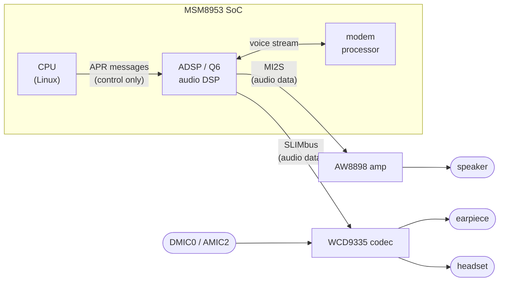
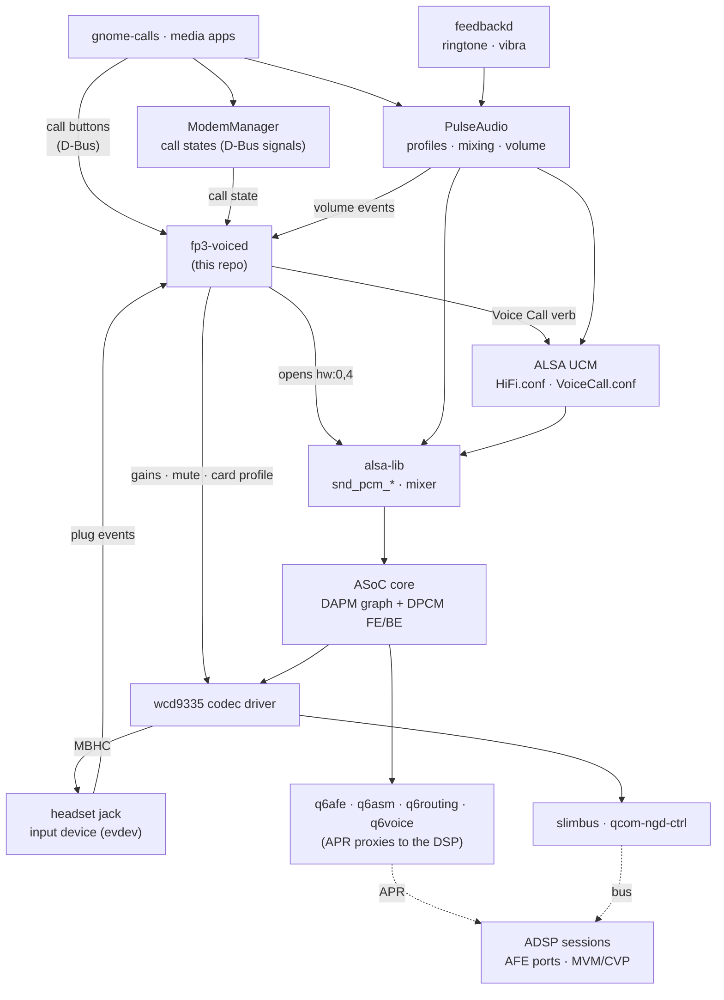
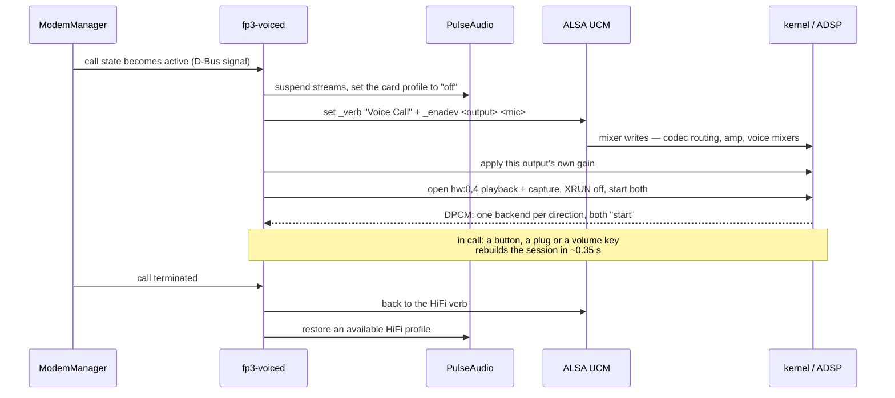

# fp3-pmaports

The postmarketOS package that builds the Fairphone 3 mainline kernel — mainline
`msm8953` with the WCD9335 SLIMbus audio work, the Sony IMX363 rear camera and
the PMI632 charger.

Without this, the [kernel branches](https://github.com/llg179/linux) are only
source: nothing records which config was used, which symbols had to be turned
on by hand, or how the thing was actually built.

## The goal, and why the names have no version in them

`llg179/linux` is a **rolling forward-port** of Fairphone 3 support onto the
latest [`msm8953-mainline`](https://github.com/msm8953-mainline/linux) release
(`X.Y.Z/main`), kept moving from one kernel base to the next until the work
lands upstream on the LKML.

Because the base keeps changing, the kernel version is deliberately confined to
the **two places where it is genuinely the identity of something**:

* the base segment of a base-relative branch — `wip/7.1.3/audio`,
  `submit/7.1.3/audio`, `integration/7.1.3` — a patch series *is* "the series
  against 7.1.3", so the version belongs in the name, and the old ones are
  pruned once a base is retired; and
* the package `pkgver`.

Everything else — the package name `linux-fp3`, its flavor `fp3`, the config
`config-fp3.aarch64`, the test suite, the boot entries — carries **no version**.
Bumping `pkgver` is the single edit that moves the whole thing to a new kernel.

## The branch model

For a base `X.Y.Z` there are three layers, each base-relative:

| branch | layer | contents |
|---|---|---|
| `X.Y.Z/main` | base | the upstream `msm8953-mainline` release; not ours to rename, we just follow the newest |
| `wip/X.Y.Z/<category>` | work | the category's commits rebased onto the base, **plus the bump fixes** — messy, evolving history |
| `integration/X.Y.Z` | build | the cherry-pick union of the `wip/X.Y.Z/*` branches; **this is what the package builds**, and it is versioned so the last working `integration/<prev>` survives while the new base is still being fixed |
| `submit/X.Y.Z/<category>` | upstream | the **minimal** series distilled from `wip/X.Y.Z/<category>` — created only once everything works, ready to post to the LKML |

The four categories are always the same:

| category | what it adds |
|---|---|
| `audio` | WCD9335 over SLIMbus: playback, the four digital mics, headset (MBHC) jack detection |
| `voice` | call audio, by routing the voice mixers over SLIMbus |
| `camera` | the Sony IMX363 rear sensor |
| `charger` | the PMI632 charger, via `qcom_smbx` |

Worked across two real bases — `7.0.9` (retired, kept as history) and `7.1.3`
(current) — every branch reads off at a glance:

| role | `7.0.9` (previous) | `7.1.3` (current) |
|---|---|---|
| base (upstream fork) | `7.0.9/main` | `7.1.3/main` |
| work + fixes | `wip/7.0.9/{audio,voice,camera,charger}` | `wip/7.1.3/{audio,voice,camera,charger}` |
| device build | `integration/7.0.9` | `integration/7.1.3` |
| LKML minimal series | — *(rolled straight into 7.1.3)* | `submit/7.1.3/{audio,voice,camera,charger}` |
| package `pkgver` | `7.0.9` | `7.1.3` |

Reading it: "what runs on the phone" is always `integration/<pkgver>`; "what
goes to the kernel" is always `submit/<pkgver>/<category>`; the base version is
the only thing that changes. (`7.1.3` was brought up cleanly, so its `wip` and
`submit` branches point at the same commits; on a messier bump they diverge —
`wip` carries the fix history, `submit` the distilled series.)

**The category rule (version-free):** a change lands on `wip/X.Y.Z/<category>`
**and** is cherry-picked onto `integration/X.Y.Z` — the two never diverge,
integration is only ever the sum of the `wip` branches. `submit/X.Y.Z/<category>`
is regenerated from `wip` when the base is done; it is not edited by hand.

**Why `integration` is versioned.** A base bump breaks things — a rebased driver
that no longer applies cleanly, a renamed Kconfig symbol, a clock that changed
under it — and fixing them takes iterations of build → deploy → test. Keeping
`integration/<prev>` (and the package's previous `pkgver`) intact means the
device always has a **known-good kernel to fall back to** while the new base is
brought up. A single, mutable integration branch would destroy the working
version the moment the new base was checked out.

## Rolling to a new kernel base

When `msm8953-mainline` cuts a new release — say `7.2.0/main` — this is the
whole procedure. Nothing here is renamed for the version; only the base segment
of the branches and the package `pkgver` change.

### Setting the checkouts up (once per machine)

Three trees are involved: the kernel fork, this repo, and a postmarketOS build
environment. The kernel fork keeps upstream and our work on **separate
remotes** — `origin` is `msm8953-mainline` and is never pushed to, `fork` is
ours and is the only push target.

```sh
# the kernel: upstream as origin, our fork as fork
git clone https://github.com/msm8953-mainline/linux.git linux-fp3
cd linux-fp3
#   port 443, because plain SSH (22) stalls on some networks
git remote add fork ssh://git@ssh.github.com:443/llg179/linux.git
git fetch fork
cd ..

# this repo: the APKBUILD, the config, the userspace bits and the tests
git clone ssh://git@ssh.github.com:443/llg179/fp3-pmaports.git

# the build environment: pmbootstrap + a pmaports checkout it works out of
git clone https://gitlab.postmarketos.org/postmarketOS/pmbootstrap.git
git clone https://gitlab.postmarketos.org/postmarketOS/pmaports.git
./pmbootstrap/pmbootstrap.py init          # device fairphone-fp3, edge, aarch64

# the package lives in pmaports; this repo is its home, so mirror it in
mkdir -p pmaports/device/testing/linux-fp3
cp fp3-pmaports/linux-fp3/{APKBUILD,config-fp3.aarch64} \
   pmaports/device/testing/linux-fp3/
```

A wrapper keeps the config and work directory explicit, which matters once more
than one checkout exists on the machine:

```sh
cat > pmb <<'EOF'
#!/bin/bash
exec "$PWD/pmbootstrap/pmbootstrap.py" -c "$PWD/pmbootstrap_v3.cfg" -w "$PWD/work" "$@"
EOF
chmod +x pmb
```

Two traps worth knowing before the first fetch:

* **the base branch names contain a slash**, so `git fetch origin '7.2.0/main'`
  leaves the result in `FETCH_HEAD` and there is usually **no
  `origin/7.2.0/main` ref**. Resolve the SHA once (`git rev-parse FETCH_HEAD`)
  and branch from that; `git checkout -b … origin/7.2.0/main` fails, and if it
  is chained with `&&`-less commands the ones after it run on whatever branch
  you were already on.
* **a shallow clone lies about history.** `git log -- <path>` in a `depth=1`
  checkout returns one commit for every path, which looks like an answer. Clone
  in full, or query the API instead.

### The procedure

Everything from here runs **in the kernel checkout** unless a step says
otherwise; the two steps that touch the package say where they run.

```sh
cd linux-fp3

# 0. fetch the new base (see the slash trap above) and give it a local ref, so
#    the steps below can name it instead of carrying a SHA around
git fetch origin '7.2.0/main'
git branch -f 7.2.0/main FETCH_HEAD

# 1. rebase each category's work onto the new base -> wip/7.2.0/<category>
#    (start from the previous base's wip if it still exists, else its submit)
for cat in audio voice camera charger; do
	git checkout -b wip/7.2.0/$cat submit/7.1.3/$cat
	git rebase --onto 7.2.0/main 7.1.3/main wip/7.2.0/$cat
	#   resolve conflicts; the commit COUNT does not grow - a rebase replays
	#   the same minimal series, it does not add commits
	git push fork wip/7.2.0/$cat          # new branch, no force-push
done

# 2. build integration/7.2.0 = cherry-pick union of the wip branches
git checkout -B integration/7.2.0 7.2.0/main
git cherry-pick <wip/7.2.0/audio range> <voice> <camera> <charger>
git push -f fork integration/7.2.0        # derived + disposable, force is fine

# 3. build the package - the ONLY version edit
#    linux-fp3/APKBUILD: pkgver=7.2.0, _commit=<integration/7.2.0 HEAD>
git push fork integration/7.2.0           # push BEFORE checksum (404 trap below)
( cd ../fp3-pmaports                      # <- the package, not the kernel
  $EDITOR linux-fp3/APKBUILD              #    pkgver + _commit, nothing else
  cp linux-fp3/APKBUILD ../pmaports/device/testing/linux-fp3/ )
cd .. && ./pmb checksum linux-fp3         # or pmbootstrap, if it is on PATH
./pmb build --arch aarch64 linux-fp3
cd linux-fp3

# 4. deploy KEEPING the last good kernel as a fallback boot entry, then test
#    (see Deploying); the working integration/7.1.3 build stays bootable
( cd ../fp3-pmaports && tests/fp3-selftest )

# 5. fix the bump errors on wip/7.2.0/<category>, cherry-pick each onto
#    integration/7.2.0 (category rule), rebuild the package, redeploy, retest.
#    Loop until fp3-selftest is green.

# 6. everything works -> distil the minimal upstream series
for cat in audio voice camera charger; do
	git checkout -b submit/7.2.0/$cat wip/7.2.0/$cat
	#   squash/reorder to the minimal set, checkpatch each commit, keep the
	#   Assisted-by: trailer and NO Signed-off-by from the AI (see the
	#   msm8953-mainline-pr skill)
	git push fork submit/7.2.0/$cat
done

# 7. the new base is validated -> prune the old one
for cat in audio voice camera charger; do
	git push fork --delete wip/7.1.3/$cat
	git push fork --delete submit/7.1.3/$cat   # once its LKML business is done
done
git push fork --delete integration/7.1.3
```

**Steady state:** one live base. During a transition two bases coexist for a
while — useful, because the `7.1.3` series can stay under LKML review while
`7.2.0` is brought up beside it — then the old one is pruned.

**Posting to the LKML** is independent of this base-rolling. The device
integration rides `X.Y.Z/main`; a subsystem submission targets that subsystem's
`-next` tree instead. At post time, cut a throwaway branch from
`submit/<base>/<category>`, rebase it onto `sound/for-next` (audio/voice),
`media` (camera), `power-supply` (charger) or the SoC tree (dts), run
`checkpatch` / `get_maintainer` / `b4`, send, and drop the throwaway branch. The
series version (v1, v2, …) lives in the cover letter, not in a branch name.

## Building

Assumes the checkouts and the `pmb` wrapper from
[Setting the checkouts up](#setting-the-checkouts-up-once-per-machine). After a
change to the APKBUILD or the config, mirror it into pmaports and build:

```sh
cp fp3-pmaports/linux-fp3/{APKBUILD,config-fp3.aarch64} \
   pmaports/device/testing/linux-fp3/

./pmb checksum linux-fp3            # only needed if you changed _commit
./pmb build --arch aarch64 linux-fp3
```

The source tarball is ~250 MB straight from GitHub, so the first fetch takes a
minute or two. A warm ccache rebuild is around four minutes; a new `_commit`
means a new source directory and therefore a cold ccache, which is 20–35.

⚠️ **Push `integration/<base>` before you bump `_commit`.** The package fetches
the tarball from GitHub, so a commit that only exists locally gives a 404 during
`./pmb checksum`. If you skip the checksum step, the build fails one step
later with the far less helpful

```
ERROR: linux-fp3-<sha>.tar.gz is missing in checksums
```

which points at the checksums rather than at the missing push.

## Deploying

The built package lands in the work directory the wrapper pins
(`work/packages/edge/aarch64/`, or `~/.local/var/pmbootstrap/packages/...` with
a default pmbootstrap). An apk is a gzipped tar, so unpack it and take the
pieces you need:

```sh
APK=work/packages/edge/aarch64/linux-fp3-7.1.3-r0.apk
mkdir -p /tmp/apk && tar xzf "$APK" -C /tmp/apk

tar tzf "$APK" | grep q6voice-dai        # check the module is actually in there
```

**Device tree only** — extlinux loads the fdt separately, so no kernel flash and
no module rebuild is needed. Roughly a two-minute round trip:

```sh
scp /tmp/apk/boot/dtbs/qcom/sdm632-fairphone-fp3.dtb fp3@$FP3_DEV_IP:/tmp/
ssh fp3@$FP3_DEV_IP 'sudo cp /tmp/sdm632-fairphone-fp3.dtb /boot/ && sudo sync && sudo reboot'
```

**A driver change** — copy the module in beside the others and refresh the
dependency list:

```sh
KREL=$(ssh fp3@$FP3_DEV_IP uname -r)
scp /tmp/apk/lib/modules/$KREL/kernel/sound/soc/qcom/qdsp6/q6voice-dai.ko \
    fp3@$FP3_DEV_IP:/tmp/
ssh fp3@$FP3_DEV_IP "sudo cp /tmp/q6voice-dai.ko \
    /lib/modules/$KREL/kernel/sound/soc/qcom/qdsp6/ && sudo depmod -a && sudo reboot"
```

**A full kernel change (a new base)** — deploy by hand. The pmOS
`mkinitfs`/`boot-deploy` tooling does **not** work here, for two independent
reasons, so do not rely on the apk's install trigger to put the kernel in
`/boot`:

* `mkinitfs` refuses to run with more than one kernel *flavor* present
  (`only one kernel release/flavor is supported`), and a device that has been
  through a rename or a parallel-package phase easily has two or three stamps
  under `/usr/share/kernel/`; and
* `boot-deploy` regenerates the extlinux config, which fails against the FP3's
  hand-maintained lk2nd + `extlinux.conf` (`boot-deploy failed`, exit 1).

Because every boot-critical driver is built **in** (`MMC_BLOCK`, `SDHCI_MSM`,
`EXT4`, `F2FS` = `y`), the one initramfs boots any of these kernels, so a
fallback is just a second set of boot files and a second extlinux entry. Full
procedure, from the host (`$D` = device, e.g. `fp3@172.16.42.1`):

```sh
APK=work/packages/edge/aarch64/linux-fp3-7.1.3-r0.apk
scp "$APK" $D:/tmp/linux-fp3.apk

ssh $D 'sudo sh -c '"'"'
  cd /boot

  # 1. keep the current kernel as the version-free fallback
  cp -n vmlinuz vmlinuz-fallback
  cp -n sdm632-fairphone-fp3.dtb sdm632-fairphone-fp3.dtb-fallback

  # 2. register the package (for apk info + the /usr/share/kernel/fp3 stamp that
  #    01-identity checks); its mkinitfs trigger will error - that is expected
  apk add --allow-untrusted /tmp/linux-fp3.apk

  # 3. leave exactly one flavor: drop the old package and any stale flavor stamp
  apk del linux-fp3-709 2>/dev/null
  rm -rf /usr/share/kernel/fp3-713 /usr/share/kernel/fp3-709   # whatever is stale

  # 4. copy the kernel, DTB and modules in by hand (bypassing boot-deploy)
  mkdir -p /tmp/x && tar xzf /tmp/linux-fp3.apk -C /tmp/x
  KV=$(cat /tmp/x/usr/share/kernel/fp3/kernel.release)
  cp /tmp/x/boot/vmlinuz /boot/vmlinuz
  cp /tmp/x/boot/dtbs/qcom/sdm632-fairphone-fp3.dtb /boot/sdm632-fairphone-fp3.dtb
  cp -a /tmp/x/lib/modules/$KV /lib/modules/ && depmod $KV
  sync
'"'"''
```

Then write `extlinux.conf` by hand — two version-free entries, the new kernel as
default and the preserved one as fallback (keep the `append` line's UUIDs
exactly as they were):

```
timeout 3
default postmarketOS
menu title FP3 boot (linux-fp3 / fallback)

label postmarketOS
	kernel /vmlinuz
	fdt /sdm632-fairphone-fp3.dtb
	initrd /initramfs
	append quiet splash ... pmos_boot_uuid=<...> pmos_root_uuid=<...> pmos_rootfsopts=defaults

label postmarketOS-fallback
	kernel /vmlinuz-fallback
	fdt /sdm632-fairphone-fp3.dtb-fallback
	initrd /initramfs
	append quiet splash ... pmos_boot_uuid=<...> pmos_root_uuid=<...> pmos_rootfsopts=defaults
```

Reboot and confirm the identity: `uname -v` shows `#<pkgrel+1>-fp3` and
`tests/fp3-selftest --only identity` is green (build stamp, installed package,
source commit). To test a base before trusting it, deploy it as the *fallback*
first, or flip `default` and reboot — a power-cycle then recovers on its own
only if the entry you booted is not the default, so revert `default` as soon as
SSH returns.

⚠️ Take the DTB from the **built package**, not from your source tree — a stale
locally-built DTB is an easy way to spend an hour debugging a device tree that
was never deployed. The symptom is silent: the driver loads, the node it needs
simply is not there.

⚠️ The slot_b rootfs is 2.4 GB and normally sits around 90% full. At 100% the
graphical session does not come up at all, which looks like a kernel
regression and is not one — check `df -h /` before blaming the build.

## The config

`config-fp3.aarch64` is the postmarketOS `qcom-msm8953` config carried forward
to the current base. `prepare()` then turns on what that config misses:

| symbol | why |
|---|---|
| `CONFIG_SLIMBUS`, `CONFIG_SLIM_QCOM_NGD_CTRL`, `CONFIG_REGMAP_SLIMBUS` | the SLIMbus stack the codec lives on |
| `CONFIG_SND_SOC_WCD9335`, `CONFIG_SND_SOC_WCD_CLASSH` | the codec |
| `CONFIG_QCOM_BAM_DMA` | SLIMbus data path |
| `CONFIG_SND_SOC_AW8898` | speaker amplifier |
| `CONFIG_VIDEO_IMX363` | rear camera sensor |
| `CONFIG_DRM_PANEL_HIMAX_HX83112B` | the display panel |
| `CONFIG_CHARGER_QCOM_SMB2` | the PMI632 charger |

### The panel symbol is a trap worth knowing about

The panel driver was called `CONFIG_DRM_PANEL_FAIRPHONE_FP3_HX83112B` up to
6.13 and was renamed to `CONFIG_DRM_PANEL_HIMAX_HX83112B` afterwards. Carrying
a 6.13 config forward therefore leaves the panel driver **silently not built** —
`olddefconfig` drops the unknown symbol without a word, the build succeeds, and
the failure only shows up on the device as a compositor that loops on:

```
phoc-wlroots-CRITICAL: [backend/backend.c:245] Found 0 GPUs, cannot create backend
```

with no `/dev/dri` at all. A kernel bump can lose a feature without a single
build warning; **on every base bump, re-check that the symbols above still
exist** — this is exactly the kind of breakage step 5 of the rolling procedure
is there to catch.

## AI-assisted development

### What was written here, and what it builds on

Almost nothing here is new code in isolation: every module is somebody else's
driver with a Fairphone 3 shaped hole filled in. This table says, per module,
whose work it is, where it came from, and what this port added on top —
**everything in the "what this port adds" column was developed with the
assistance of [Claude Code](https://www.anthropic.com/claude-code)**, Anthropic's
generative-AI coding agent, exactly as the device tree section below records for
the `.dts`.

| module | upstream work it builds on | what this port adds (AI-assisted) |
|---|---|---|
| `sound/soc/codecs/wcd9335.c` | the WCD9335 codec driver — Qualcomm/Linux Foundation (2015–2016) and Linaro (2017–2018), maintained by Srinivas Kandagatla | init fixes (efuse sense, `MCLK_CFG`), the TX front-end hold release, mic-bias and DMIC rate from the DT, MBHC jack detection **revived from the 2018 series that was never merged**, the MBHC button debounce, and the missing `DEC0..DEC8` capture gains |
| `sound/soc/qcom/apq8016_sbc.c` | the msm8916 machine driver — Qualcomm/Linux Foundation (2015), maintained by Srinivas Kandagatla | a SLIMbus backend, the Fairphone 3 WCD9335 card definition, and the digital-microphone widgets |
| `sound/soc/qcom/qdsp6/q6voice*.c` | the Q6 Voice DAI driver, which is **not in mainline**: written by Stephan Gerhold, extended by Otto Pflüger (VoiceMMode1) and Vincent Knecht (voice port controls), carried by `msm8953-mainline` | the SLIMbus voice path: the VoiceMMode1 / CS-Voice mixers wired to `SLIMBUS_0_RX/TX`, including the mixer → port output route |
| `sound/soc/qcom/qdsp6/q6afe.c` | the AFE proxy — Qualcomm/Linaro, maintained by Srinivas Kandagatla | `ADSP_EALREADY` on a port start treated as success, so two front ends may share a backend |
| `drivers/remoteproc/qcom_q6v5_pas.c` | Sony Mobile (2014) and Linaro (2016), maintained by Bjorn Andersson | the QDSP6SS SLIMbus framer quirk msm8953 needs before the codec will answer |
| `drivers/slimbus/qcom-ngd-ctrl.c` | Qualcomm/Linux Foundation (2011–2017) and Linaro (2018), maintained by Srinivas Kandagatla | re-clearing that framer bit immediately before the capability exchange |
| `drivers/media/i2c/imx363.c` | Intel's IMX3xx sensor drivers (2018) as the structural template | the IMX363 register programming, reverse-engineered from the sensor as wired on the FP3 (same family as the Pixel 3a), plus its power sequence and link warm-up |
| `drivers/power/supply/qcom_smbx.c` | the SMB2 charger driver — Qualcomm (2016–2019) and Linaro (2023), by Casey Connolly | SMB5 (PMI632) support, with the register layout taken from Qualcomm's downstream `qpnp-smb2`/`qpnp-smb5` in the Fairphone 3 kernel source release |
| `arch/arm64/boot/dts/qcom/sdm632-fairphone-fp3.dts` | the upstream board file — see [Device tree provenance](#device-tree-provenance) for its 21-commit genealogy and every contributor | the audio, camera and charger nodes |
| `userspace-audio/`, `tests/`, this packaging | — | written for this port |

### How the assistance is recorded

Every commit on this repository and on the `wip`/`integration` branches carries
a `Co-authored-by: Claude` trailer. The `submit` branches, which are meant for
the kernel, instead carry the kernel's `Assisted-by: Claude:<model>` trailer and
**no** `Signed-off-by` from the AI — a DCO sign-off is a human certification and
an AI cannot give one.

### Where it may and may not go

Because of the AI assistance, **this code must not be submitted or upstreamed to
postmarketOS.** postmarketOS's
[AI policy](https://docs.postmarketos.org/policies-and-processes/development/ai-policy.html)
forbids the use of generative AI tools in the project — *"We forbid the use of
generative AI tools in postmarketOS"* — and specifically prohibits "submitting
contributions fully or in part created by generative AI tools". This repository
and the linked kernel branches are a personal fork for running mainline on the
Fairphone 3; they are deliberately kept out of the postmarketOS contribution
channels for this reason. The LKML, whose
[coding-assistants policy](https://www.kernel.org/doc/html/latest/process/coding-assistants.html)
allows disclosed AI assistance, is the one open upstream — which is what the
`submit/<base>/<category>` branches are for.

## How audio works on this device

This describes the setup that works today: what carries the sound, which piece
configures what, and the rules the arrangement has to obey. Media playback and
capture go one way through the stack, a phone call goes another; both are
described below.

### The hardware decides the shape of the software



The single most important fact: **audio data does not flow through the CPU.**
The ADSP moves it between the codec, the amplifier and the modem. Linux only
sends control messages ("start AFE port 0x4000", "create a voice session with
this RX and TX port"). Everything else follows from that: Linux and the DSP each
keep their own state, and every piece below exists to keep the two in agreement.

The earpiece, the headset and every microphone hang off the **WCD9335 on
SLIMbus**; only the loudspeaker is elsewhere, on the **AW8898 over Quinary
MI2S**. So a call routed to the earpiece and the same call on speakerphone use
two different buses and two different volume controls.

### The layers



**1. Bus drivers** (`slimbus`, `qcom-ngd-ctrl`). The physical SLIMbus link to the
codec: register access and channel allocation.

**2. Codec driver** (`wcd9335.c`). Everything inside the chip: which microphone
feeds which decimator, which interpolator drives which output, the gain
registers, and headset detection (MBHC). This is where mixer controls like
`RX0 Mix Digital Volume`, `DEC0 Volume` and `DMIC MUX0` come from, and where the
`Headset Jack` switch is reported — both as a mixer control and as an input
device that publishes plug events.

**3. DSP proxies** (`q6afe`, `q6asm`, `q6routing`, `q6voice`). These move no
audio. They send APR commands to the ADSP: start an AFE port, create a voice
session (MVM/CVP) bound to an RX and a TX port.

**4. ASoC core — two state machines.**

* **DAPM** is the widget graph. Mixer controls open and close edges; a path that
  is complete *and* has a running stream gets powered. Ground truth lives in
  `/sys/kernel/debug/asoc/<card>/<component>/dapm/*` (`EAR PA: On`).
* **DPCM** pairs frontends with backends. `hw:0,0` (MultiMedia1) and `hw:0,4`
  (VoiceMMode1) are frontends; `SLIMBUS_0_RX/TX` and `Quinary MI2S` are
  backends. Opening a frontend starts whichever backends the DAPM graph says are
  connected. Ground truth: `/sys/kernel/debug/asoc/<card>/VoiceMMode1/state`.

**5. ALSA in userspace.** `alsa-lib` provides `snd_pcm_*` and the mixer; **UCM**
turns dozens of mixer writes into named use cases (`HiFi`, `Voice Call`) and
devices (`Earpiece`, `Speaker`, `Headphones`, `Mic`, `Headset`). UCM only sets
controls — it starts nothing.

**6. PulseAudio.** Loads the card, turns UCM verbs into card profiles, creates
sinks and sources, mixes applications and applies volume. It owns everything
that is *not* a call: media, notifications, and the ringtone.

**7. The daemons above it.** ModemManager owns the call state machine;
gnome-calls presses the in-call buttons over D-Bus; feedbackd plays the ringtone
and drives the vibrator; **`fp3-voiced`** (this repo) owns the call audio.

### The two paths

**Media** is the ordinary one: an app plays into PulseAudio, PulseAudio mixes it
into the sink that the active UCM device describes, and the stream reaches the
codec (or the amplifier) through `hw:0,0`. Volume is applied by PulseAudio on
the `PlaybackVolume` control named by the UCM device.

**A call** never passes through PulseAudio at all — the audio goes
modem ↔ ADSP ↔ codec, and the CPU's only job is to set the routing up and hold
the voice frontend open. That is `fp3-voiced`:



### What each piece in this repo contributes

| path | what it does |
|---|---|
| `userspace-audio/ucm2/Fairphone/fp3/HiFi.conf` | media use case: the sinks and sources PulseAudio exposes, with their `PlaybackVolume` controls and the jack each one follows |
| `userspace-audio/ucm2/Fairphone/fp3/VoiceCall.conf` | the call use case: codec routing per output (`Earpiece`, `Speaker`, `Headphones`) and per input (`Mic`, `Headset`), plus the voice mixers. Every output also **drops the other outputs' routes and gains**, and the capture devices deliberately have **no `CapturePCM`** — the call's uplink is not a PulseAudio source |
| `userspace-audio/ucm2/conf.d/Fairphone_3/Fairphone_3.conf` | registers both verbs — a verb that is not listed here does not exist as far as PulseAudio is concerned |
| `userspace-audio/systemd/fp3-voiced` (+ `.service`) | the call-audio daemon described above. Replaces `q6voiced` (`Conflicts=`), which neither applies the routing nor starts the streams |
| `userspace-audio/systemd/fp3-mic-select` (+ `.service`) | picks the built-in microphone for media capture at boot |
| `userspace-audio/pulse/90-fp3-mic.pa` | PulseAudio drop-in for the capture side |
| `userspace-audio/udev/61-fp3-vibra.rules` | tags `pm8xxx_vib_ffmemless` so feedbackd may use it — without it an incoming call is silent *and* still |

### The rules this arrangement obeys

These are the constraints that make the difference between a working call and a
silent one; each is enforced somewhere in the code above.

1. **The voice path configures the AFE port first.** Whoever starts a shared AFE
   port configures it; a later start only answers `ADSP_EALREADY` and gets the
   first one's configuration. So PulseAudio is asked to let go of the card
   *before* the Voice Call verb is applied.
2. **PulseAudio gives the card up for the duration of the call.** Suspending its
   streams is not enough — a suspended sink is resumed by any client that wants
   to play — so the card profile goes to `off` and is restored afterwards. It
   must never be handed a Voice Call profile: its media sink would open on the
   call's own SLIMbus backend.
3. **Volume is mirrored, not delegated, and is per output.** Because of rule 2,
   `fp3-voiced` applies the level to the gain that is really in the path:
   `RX Volume` (AW8898) on speakerphone, `RX0 Mix Digital Volume` for the
   earpiece, `RX1`+`RX2` for headphones — each with its own range, since +26 dB
   is comfortable against the ear and painful inside it. Every output keeps its
   own level, so plugging a headset into a loud speakerphone call is safe.
4. **The playback leg starts with XRUN detection off.** The voice PCM carries no
   data, so the ALSA core refuses to start an empty playback stream unless
   `stop_threshold` is set to the buffer boundary. Without this the downlink is
   silent while everything else looks correct.
5. **Changing the output is a full teardown.** The ADSP binds the voice session
   to the RX port it was given at creation, so a speakerphone toggle or a jack
   event goes back to the `HiFi` verb and builds the session again — measured at
   0.31–0.34 s end to end.
6. **Each UCM device cleans up after the others.** `alsaucm` is a fresh process
   every time it runs, with no memory of the device enabled before, so a
   `DisableSequence` never runs across invocations. Enabling an output therefore
   zeroes the other outputs' routes *and* gains itself; without that the voice
   frontend ends up with two backends and `hw_params` fails with `-22`.
7. **The microphone follows the jack, not the output**, and **mute is a gain, not
   a route**. A headset stays the input even on speakerphone. Muting by taking
   the microphone out of the DAPM graph silences it permanently on this codec —
   measured: the level goes to exactly zero and stays there for the rest of the
   boot, through a fresh PCM open and a full re-apply of the routing. `DEC0
   Volume` (a kernel control this port adds) is reversible.
8. **Everything is restored on the way out** — the `HiFi` verb and a HiFi profile
   PulseAudio reports as *available* — and the same cleanup runs at startup and
   periodically while idle, because the user's PulseAudio only appears when the
   phone is unlocked and comes back with whatever profile it remembered.
9. **Nothing is polled that the system publishes.** The jack is an input device,
   ModemManager signals call state on the system bus, and PulseAudio publishes
   volume changes: the daemon watches all three and asks nothing until something
   moves. Idle cost is about 0.1% of a CPU.

### Checking it works

| what to look at | what it should say |
|---|---|
| `journalctl -u fp3-voiced -b` | the call state, `call audio up (<output> + <mic>)`, and a `dpcm:` snapshot every ten seconds |
| `/sys/kernel/debug/asoc/<card>/VoiceMMode1/state` | exactly one backend per direction, both `start` (`Quinary MI2S` on speakerphone, `SLIM Playback` otherwise) |
| `dmesg` | no `AFE enable ... failed` |
| `pactl list cards \| grep 'Active Profile'` | a `HiFi` profile whenever no call is up — never `off`, never `Voice Call` |
| `gsettings get org.sigxcpu.feedbackd profile` | `full` — `quiet` mutes the ringtone |
| `amixer -c 0 cget name='RX0 Mix Digital Volume'` | tracks the volume keys during an earpiece call |

After editing any UCM file, restart PulseAudio (`pulseaudio -k`) — it reads the
sequences when it loads the card, so a running instance still applies the old
ones. And note that while the screen is locked the *greeter* runs its own
PulseAudio: a `pactl` aimed at the user's runtime directory then talks to an
autospawned empty daemon, which looks exactly like "the card lost its sink".

## Related

* <https://github.com/llg179/linux> — the kernel: `wip/<base>/<category>` (work
  plus bump fixes), `integration/<base>` (what the device runs), and
  `submit/<base>/<category>` (the minimal series for the LKML)
* <https://github.com/llg179/Claude-skills-Fairphone3> — the method: bring-up
  notes, ground-truth techniques, the guard-railed test loop, and the
  `msm8953-mainline-pr` skill for preparing a `submit` series
* [`docs/device_tree/`](docs/device_tree/) — the device trees themselves: our
  change before and after, plus both downstream references (the live Ubuntu
  Touch dump and Fairphone's published 3.A.0136 sources)

## Device tree provenance

Which `.dts`/`.dtsi` files the FP3 device tree is actually built from, and where
each one came from. Measured on `integration/7.1.3`; the shape does not change
across a base bump, only the commit hashes do.

The trees themselves are checked in under
**[`docs/device_tree/`](docs/device_tree/)**, so none of the claims below have to
be taken on trust:

| | |
|---|---|
| [`before_update/`](docs/device_tree/before_update/) → [`after_update/`](docs/device_tree/after_update/) | the two files we modify, in both states — `diff` them for our exact delta |
| [`downstream/UT/`](docs/device_tree/downstream/UT/) | the 4.9 downstream tree as it **runs**, dumped off the phone under Ubuntu Touch |
| [`downstream/FP3/3.A.0136/`](docs/device_tree/downstream/FP3/3.A.0136/) | the same tree as Fairphone **publishes** it, from their official GPL release |

[`docs/device_tree/downstream/README.md`](docs/device_tree/downstream/README.md)
compares the last two node by node: they are the same tree (1804 nodes each, five
nodes differing, nearly all of it the bootloader filling in `/chosen` and
`/memory`), and it identifies which vendor file the FP3 actually is —
`sdm632-mtp-s3.dts`, not the SDM450 board of the same name.

The board `.dtb` is assembled from **five** files through the `#include` chain,
and only **two** of them carry any of our work:

| file | lines | commits | where it comes from |
|---|---|---|---|
| `sdm632-fairphone-fp3.dts` | 887 | 21 | Luca Weiss' upstream FP3 board file (since 2022-02-20) **+ one commit of ours** (`ca289613`, +358) |
| `pmi632.dtsi` | 230 | 6 | upstream PMI632 PMIC description (`a1f0f2eb`) **+ one commit of ours** (`ca289613`, +21 — the charger node) |
| `sdm632.dtsi` | 142 | 8 | upstream only — `msm8953.dtsi` plus the SDM632 CPU/rpmpd overrides; untouched |
| `msm8953.dtsi` | 3435 | 84 | upstream msm8953-mainline SoC file; untouched |
| `pm8953.dtsi` | 200 | 10 | upstream PM8953 PMIC file; untouched |

Note that the `wcd_intr_default` / `cdc_reset_active` (`&tlmm`) and
`tasha_mclk_default` (`&pm8953_gpios`) pin muxes live in the **board** file as
`&`-references, not in the SoC-level files — which is why the bottom three rows
stay untouched.

### Genealogy of the board file (21 commits, oldest first)

The "in mainline" column is the answer to `git merge-base --is-ancestor <sha>
torvalds/master`, and the release is `git describe --contains`. **17 of the 20
upstream commits are in Linus' tree**; three are carried only by
msm8953-mainline.

| commit | origin | in mainline |
|---|---|---|
| `308b26cddb04` initial dts for Fairphone 3 | Luca Weiss, 2022-02-20 | ✅ v5.18-rc1 |
| `b08f5cbd69dc`, `372698e8df26` gpio-key / RPM-regulator node names | tree-wide dtschema alignment, not FP3-specific | ✅ v6.0-rc1, v6.2-rc1 |
| `6d9a666d49bf` touchscreen · `29dcf3c1a815` NFC · `0c4f10917d22` notification LED · `5b006a82a2bb` WiFi/BT · `2dee68e77cb5` **LPASS** · `90053b1574f8` USB-C · `ffaa4b5d5d07` vibrator | Luca Weiss, one commit per feature | ✅ v6.2-rc1 … v6.11-rc1 (LPASS + WiFi/BT in v6.8-rc1) |
| `09a3840bcb72` status properties last · `a4600b160eca` newlines between regulators | pure style commits, no functional change | ✅ v6.16-rc1 |
| `9ab813d5191f` adsp+wcnss firmware-name · `d0c38cbe3556` modem · `4ea55ecb4990` display+GPU · `9e834e768d0b` camera fixed regulators · `cfc22c2121cb` CCI + EEPROM | Luca Weiss | ✅ v6.16-rc1 (first two), v6.18-rc1, v7.0-rc1 (last two) |
| `4fd8c23afa2e` **AW8898 amplifier** | Luca Weiss, 2025-04-06 — the `FROMLIST v2` subject prefix says it plainly | ❌ **fork-only** — still not in Linus' tree, and no equivalent landed under another hash |
| `4335b0ae1eb6` enable speaker | Luca Weiss, 2023-04-18 — builds on the AW8898 node | ❌ **fork-only**, carried along with it |
| `60f6f604cf3c` enable venus | Luca Weiss, 2026-05-06 — already present in the 7.0.9 base too, *not* something the 7.1.3 bump brought in | ❌ **fork-only** |
| **`ca2896133002`** integrated DT (audio + charger + camera) | **ours**, 2026-07-25 | ❌ ours, see `submit/<base>/*` |

### What our commit adds, and what it was derived from

`ca289613` adds 375 of the 887 lines, in four separable blocks:

| block | nodes | derived from |
|---|---|---|
| **audio** | `slimbam: dma-controller@c104000`, `slim_msm: slim-ngd@c140000`, `tasha_ifd: ifd@0,0`, `wcd9335: codec@1,0` (`slim217,1a0`), `divclk1_cdc` (gpio-gate-clock), `wcd_vout_1p8`, three pin-mux nodes, and the `slim-playback`/`slim-capture` DAI links inside `&sound_card` | addresses and wiring from the downstream 4.9 tree (`msm8953.dtsi`, `msm8953-audio.dtsi`, `msm8953-ext-codec-mtp.dts`); the **node shape and the `slim217,1a0` compatible follow the existing mainline WCD9335 boards** (DragonBoard 820c, OnePlus 3), not the downstream `qcom,tasha-slim-pgd` scheme |
| **camera** | `camera@1a` (`sony,imx363`) plus the `&camss` `port@0` / `csiphy0_ep` graph | downstream `msm8953-camera-sensor-*.dtsi` data, translated to the mainline camss graph binding; sits on top of Luca's `9e834e76` + `cfc22c21` regulator/CCI groundwork |
| **charger** | `&pmi632_charger` and `fp3_battery` (`simple-battery`) | the counterpart of the new charger node added to `pmi632.dtsi` |
| **sound card** | extends `&sound_card` rather than rewriting it | the base already carries the AW8898/MI2S speaker path (`4fd8c23a` + `4335b0ae`) |

This one commit is **integration-only** — its own message says so, and the
per-subsystem split for upstream lives on the `submit/<base>/<category>`
branches: `submit/7.1.3/audio` (`ef0d6d3d`), `submit/7.1.3/camera` (`f42f8162`),
`submit/7.1.3/charger` (`5c0aa3dd` + `78bf6ee3`). `submit/7.1.3/voice` carries no
DTS at all — it is pure driver routing, which is correct.

### What a base bump does to the device tree (7.0.9 → 7.1.3, measured)

The commit hashes in the tables above change on every base bump, because
msm8953-mainline re-applies its series onto each new stable — so `git log
<oldbase>..<newbase>` prints the *entire* history and tells you nothing. Compare
**content**, not history:

```
git diff --stat <oldbase> <newbase> -- \
  arch/arm64/boot/dts/qcom/sdm632-fairphone-fp3.dts \
  arch/arm64/boot/dts/qcom/{sdm632,msm8953,pm8953,pmi632}.dtsi
```

Across 7.0.9 → 7.1.3 that came out as **6+/6− in `msm8953.dtsi` and nothing
else** — the board file blob is bit-identical between the two bases — and the one
change is a pure dtschema label rename on the PM8953-internal PDM pin muxes
(`cdc_pdm_lines_act`/`_sus` → `cdc_pdm_lines_default`/`_sleep`, plus the
`comp_lines` and `lines_2` pairs). The FP3 board file references none of them
(our path is WCD9335 over SLIMbus, and the board file `/delete-property/`s the
PM8953 codec's `audio-routing` anyway), so nothing had to be carried over.

Two more checks worth repeating on the next bump, both of which came out clean
here: the `#include` chain still resolves to the same five files, and the
`dt-bindings` headers the board pulls in (`qcom,q6afe.h`, `q6asm.h`,
`q6voice.h`, the msm8953 interconnect/GCC/rpmpd ones) are unchanged. Finally,
diff *our own* delta on both bases — `git diff <oldbase> integration/<oldbase>`
vs `git diff <newbase> integration/<newbase>` for the two touched files — and
confirm they are line-for-line identical (358+/4− in the board file, 21+ in
`pmi632.dtsi`); that is what proves the rebase neither dropped one of our hunks
nor reverted an upstream one.

### How much of the device tree is actually mainline

Answering this needs the real history, so the working clone carries a `torvalds`
remote and full (un-shallowed) history:

```
git fetch --unshallow origin
git remote add torvalds https://github.com/torvalds/linux.git
git fetch torvalds
git commit-graph write --reachable   # or every ancestry query below crawls
```

Then, per file, split the commits by `git merge-base --is-ancestor <sha>
torvalds/master`:

| file | commits at `v7.1.3-r0` | in Linus' tree | msm8953-mainline only | fork delta vs `torvalds/master` |
|---|---|---|---|---|
| `sdm632-fairphone-fp3.dts` | 20 | 17 | **3** | +91 / −2 |
| `pmi632.dtsi` | 5 | 5 | 0 | +1 |
| `sdm632.dtsi` | 8 | 3 | 5 | +53 |
| `msm8953.dtsi` | 84 | 62 | **22** | +1001 / −49 |
| `pm8953.dtsi` | 10 | 6 | 4 | +72 |

So the FP3 **board** file is almost entirely upstream — the three exceptions are
`4fd8c23afa2e` (AW8898 amplifier), `4335b0ae1eb6` (enable speaker) and
`60f6f604cf3c` (enable venus), and a subject search over `torvalds/master`
confirms none of them landed under a different hash either. The `FROMLIST v2`
prefix on `4fd8c23afa2e` was therefore the correct signal, just not the only one.

The **SoC** file is a different story: 22 of the 84 `msm8953.dtsi` commits and 5
of the 8 `sdm632.dtsi` ones exist only in msm8953-mainline — including things our
work sits directly on top of, notably `5f0487e5a374` "add sound card" (we extend
`&sound_card`), `e54a56452736` hardware codec, `ccf0e0d540ba` camss, and
`de3e8dc98213` "replace CS-Voice with VoiceMMode1" (the voice path). That is
worth keeping in mind when writing a `submit/<base>/*` series: an LKML patch may
not assume any of those nodes exist.

## License

GPL-2.0-only, matching the kernel it builds.
