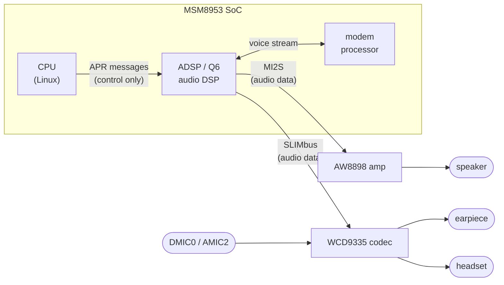
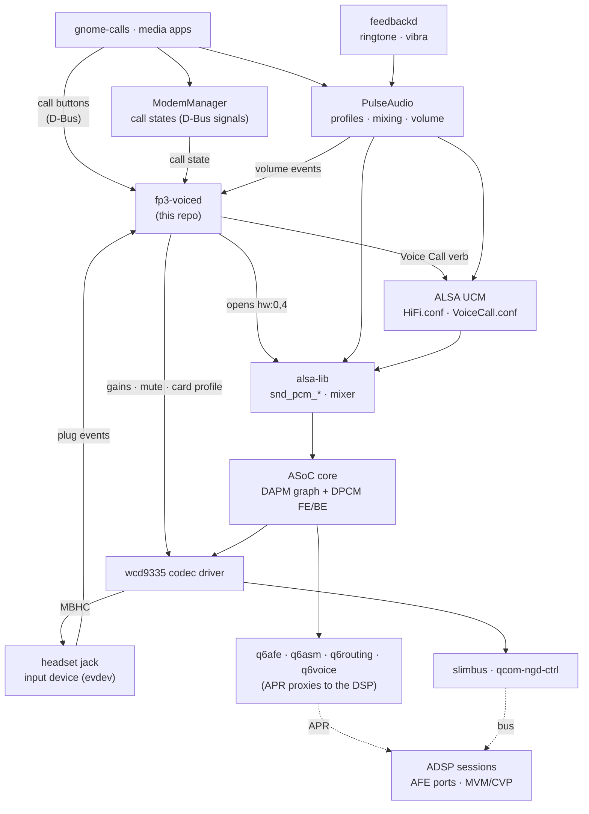
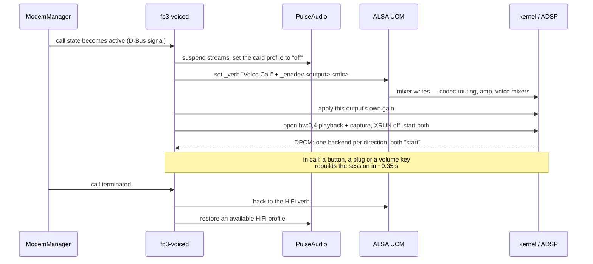

# How audio works on this device

What carries the sound, which piece configures what, and the rules the
arrangement has to obey. For the driver changes behind it see
[`../kernel/README.md`](../kernel/README.md); for the device-tree nodes,
[`../device_tree/README.md`](../device_tree/README.md).

> **AI-generated.** Written by Claude (Opus 5) under the direction of
> Lajosházi, László Gergely, who made every acoustic measurement the
> claims here rest on. How the arrangement was found — including the
> conclusions that had to be retracted — is in
> [`bringup/`](bringup/).

This describes the setup that works today: what carries the sound, which piece
configures what, and the rules the arrangement has to obey. Media playback and
capture go one way through the stack, a phone call goes another; both are
described below.

## The hardware decides the shape of the software



The single most important fact: **audio data does not flow through the CPU.**
The ADSP moves it between the codec, the amplifier and the modem. Linux only
sends control messages ("start AFE port 0x4000", "create a voice session with
this RX and TX port"). Everything else follows from that: Linux and the DSP each
keep their own state, and every piece below exists to keep the two in agreement.

The earpiece, the headset and every microphone hang off the **WCD9335 on
SLIMbus**; only the loudspeaker is elsewhere, on the **AW8898 over Quinary
MI2S**. So a call routed to the earpiece and the same call on speakerphone use
two different buses and two different volume controls.

## The layers



**1. Bus drivers** (`slimbus`, `qcom-ngd-ctrl`). The physical SLIMbus link to the
codec: register access and channel allocation.

**2. Codec driver** (`wcd9335.c`). Everything inside the chip: which microphone
feeds which decimator, which interpolator drives which output, the gain
registers, and headset detection (MBHC). This is where mixer controls like
`RX0 Mix Digital Volume`, `DEC0 Volume` and `DMIC MUX0` come from, and where the
`Headset Jack` switch is reported — both as a mixer control and as an input
device that publishes plug events.

**3. DSP proxies** (`q6afe`, `q6asm`, `q6routing`, `q6voice`). These move no
audio. They send APR commands to the ADSP: start an AFE port, create a voice
session (MVM/CVP) bound to an RX and a TX port.

**4. ASoC core — two state machines.**

* **DAPM** is the widget graph. Mixer controls open and close edges; a path that
  is complete *and* has a running stream gets powered. Ground truth lives in
  `/sys/kernel/debug/asoc/<card>/<component>/dapm/*` (`EAR PA: On`).
* **DPCM** pairs frontends with backends. `hw:0,0` (MultiMedia1) and `hw:0,4`
  (VoiceMMode1) are frontends; `SLIMBUS_0_RX/TX` and `Quinary MI2S` are
  backends. Opening a frontend starts whichever backends the DAPM graph says are
  connected. Ground truth: `/sys/kernel/debug/asoc/<card>/VoiceMMode1/state`.

**5. ALSA in userspace.** `alsa-lib` provides `snd_pcm_*` and the mixer; **UCM**
turns dozens of mixer writes into named use cases (`HiFi`, `Voice Call`) and
devices (`Earpiece`, `Speaker`, `Headphones`, `Mic`, `Headset`). UCM only sets
controls — it starts nothing.

**6. PulseAudio.** Loads the card, turns UCM verbs into card profiles, creates
sinks and sources, mixes applications and applies volume. It owns everything
that is *not* a call: media, notifications, and the ringtone.

**7. The daemons above it.** ModemManager owns the call state machine;
gnome-calls presses the in-call buttons over D-Bus; feedbackd plays the ringtone
and drives the vibrator; **`fp3-voiced`** (this repo) owns the call audio.

## The two paths

**Media** is the ordinary one: an app plays into PulseAudio, PulseAudio mixes it
into the sink that the active UCM device describes, and the stream reaches the
codec (or the amplifier) through `hw:0,0`. Volume is applied by PulseAudio on
the `PlaybackVolume` control named by the UCM device.

**A call** never passes through PulseAudio at all — the audio goes
modem ↔ ADSP ↔ codec, and the CPU's only job is to set the routing up and hold
the voice frontend open. That is `fp3-voiced`:



## The headset jack

The jack is detected by the WCD9335's MBHC block (Multi-Button Headset
Control). It is the one part of the audio path where this port cannot follow an
upstream example, because **upstream has no jack on this phone at all**: the
pre-port `sdm632-fairphone-fp3.dts` describes the AW8898 loudspeaker on Quinary
MI2S and nothing else — no SLIMbus codec, no MBHC, no micbias. Everything below
is this port's own, which is also why it is the part with the most open
questions.

### What the hardware offers, and what we actually use

| source | what it is | what we do with it |
|---|---|---|
| `ANA_MBHC_MECH` bit 7 `L_DET_EN` | mechanical level detection, raises the insert/remove interrupt | enabled at init |
| `ANA_MBHC_MECH` bit 5 `MECH_DETECTION_TYPE` | which direction L_DET is armed for | written after each edge; **never read back** |
| `ANA_MBHC_MECH` bits 4, 3 | `HPHL_PLUG_TYPE`, `GND_PLUG_TYPE` — normally-open vs normally-closed jack switches | set from DT, see below |
| `ANA_MBHC_RESULT_3` bit 4 | `SWCH_LEVEL_REMOVE` — the mechanical plug status | **not used** |
| `ANA_MBHC_RESULT_3` bit 3 | `HS_COMP_RESULT` — the headset comparator, an *electrical* result | used, wrongly, as the boot-time plug status |
| `ANA_MBHC_RESULT_3` bits 0-2 | `BTN_RESULT` — which button is down | button reporting |
| the button transient during insertion | a mic contact sweeping the ground ring trips button 0 | 3-pole vs 4-pole classification |

The `RESULT_3` layout is not guesswork: `wcd934x`, `wcd937x`, `wcd938x`,
`wcd939x` and `pm4125` all map that register identically through
`wcd-mbhc-v2`'s field table.

### How the working drivers do it, and how we differ

Three independent implementations solve the same problem, and **all three take
the direction of an edge from the hardware**. Ours is the only one that counts.

`msm8916-wcd-analog` — the driver every other msm8953/msm8916 phone uses, so
the closest relative there is:

```c
if (snd_soc_component_read(component, CDC_A_MBHC_DET_CTL_1) &
                CDC_A_MBHC_DET_CTL_MECH_DET_TYPE_MASK)
        ins = true;                     /* the edge that fired is the one we armed for */
```

`wcd-mbhc-v2` — shared by the five codecs above:

```c
detection_type = wcd_mbhc_read_field(mbhc, WCD_MBHC_MECH_DETECTION_TYPE);
wcd_mbhc_write_field(mbhc, WCD_MBHC_MECH_DETECTION_TYPE, !detection_type);
if (detection_type) { /* insertion */ }
```

ours, in `wcd9335.c`:

```c
wcd->jack_inserted = !wcd->jack_inserted;   /* a running count */
```

The consequence is structural: a count has no way back to the truth. One missed
or spurious edge inverts the reported state **for the rest of the boot**, and
the only thing that decides whether it is right at all is the value it started
from.

`msm8916-wcd-analog` has a second, independent answer that we do not: a
board-level jack-detect GPIO wired through `snd_soc_jack_add_gpios`, readable at
any time including at boot. Neither Qualcomm's msm8953 audio device tree nor
this phone's has such a line, so that route is closed here.

### The boot value, which is the actual defect

The initial state is seeded once, from `RESULT_3` bit 3 — `HS_COMP_RESULT`, the
electrical comparator, not the plug. Measured on this board that bit reads 1
constantly, so the seed always computes "nothing plugged in". That happens to be
right whenever the socket is empty at boot, which is the common case, and is
silently wrong whenever a headset is already in.

### What has been measured, and what it rules out

The tool is [`bringup/tools/jack-probe.py`](bringup/tools/jack-probe.py), which
samples every MBHC register raw while a jack is plugged and pulled. Two runs of
eight physical insert/remove cycles each, with the read path validated against a
known positive (`ANA_MICB2` and `ANA_BIAS` move when the microphone bias is
powered, so the reads do reach the codec):

- **No MBHC status register tracks the plug.** `RESULT_3` stays at `0x08` and
  `ANA_MECH` does not move, through every cycle. Replacing the counter with a
  register read is therefore not possible as the block is currently configured —
  a driver change written to do exactly that was measured before it shipped and
  would have reported "unplugged" permanently.
- **`MECH_DETECTION_TYPE` does not alternate** either, so the approach all three
  working drivers rely on is closed to us as things stand.
- **The counter itself is not the weak part.** Both runs tracked all eight edges
  with none lost, and the 3-pole/4-pole classification was correct every time
  (`SW_MICROPHONE_INSERT` clear for headphones, set for a headset).

Only six of the registers sampled are live reads. `ANA_MECH`, `ANA_ELECT`,
`ANA_ZDET` and `RESULT_1..3` are in the driver's volatile list; everything else
— the button thresholds, `CTL_1`, `CTL_2`, `PLUG_DETECT_CTL` — is served from
the regmap cache and proves nothing. The six happen to be exactly the status
registers, which is why the conclusion holds. Reading the rest live needs the
regmap `cache_bypass` knob, and with it every read crosses SLIMbus, so a full
dump takes minutes: switch it on, take **one** dump, switch it off.

### What downstream says about this board

Qualcomm's own `msm8953-audio.dtsi` carries two MBHC configurations, and the
distinction matters because this phone is squarely in the second one:

```dts
/* the internal-codec card, "msm8953-snd-card-mtp" */
qcom,msm-mbhc-hphl-swh = <0>;
qcom,msm-mbhc-gnd-swh  = <0>;

/* the external-codec card: tasha (WCD9335) on Quinary MI2S - this phone */
qcom,tasha-mclk-clk-freq = <9600000>;
qcom,msm-mbhc-hphl-swh = <1>;
qcom,msm-mbhc-gnd-swh  = <1>;
qcom,quin-mi2s-gpios = <&cdc_quin_mi2s_gpios>;
```

`swh` is the jack switch type: 0 normally closed, 1 normally open. The device
tree here now sets `qcom,hphl-jack-type-normally-open` and
`qcom,gnd-jack-type-normally-open` to match, and the change was verified to
reach the codec (`ANA_MECH` 0x85 → 0x9d, the two plug-type bits).

☠️ It changed nothing observable. The same eight-cycle measurement after the
change produced the same result: no status register moves. It is kept because
it is the correct description of the hardware according to the vendor's own
device tree, **not** because it fixed anything — a distinction worth preserving,
since a plausible-looking change that is credited with a fix it did not make
sends the next investigation in the wrong direction.

Two further differences from `wcd_mbhc_init()` remain, neither yet tested:
`GND_DET_EN` (`ANA_MECH` bit 6) and `MIC_CLAMP_CTL` are never programmed here.
`GND_DET_EN` is a weak candidate — no in-tree codec sets `cfg->gnd_det_en`, and
downstream has no device tree property for it.

### Where this leaves the open problem

Edge detection works, accessory classification works, and the status registers
are inert. What remains is the boot value, and no register currently answers it.
The two routes that do not depend on one are to report nothing until the first
real edge and take its direction from the electrical detection — which only
produces a meaningful result on a genuine insertion — or to identify and
swallow an early interrupt arriving during bring-up, if that is what inverts the
state. Distinguishing them needs the seed value and the timing of the first
edges logged from the driver itself.

## What each piece in this repo contributes

| path | what it does |
|---|---|
| `userspace-audio/ucm2/Fairphone/fp3/HiFi.conf` | media use case: the sinks and sources PulseAudio exposes, with their `PlaybackVolume` controls and the jack each one follows |
| `userspace-audio/ucm2/Fairphone/fp3/VoiceCall.conf` | the call use case: codec routing per output (`Earpiece`, `Speaker`, `Headphones`) and per input (`Mic`, `Headset`), plus the voice mixers. Every output also **drops the other outputs' routes and gains**, and the capture devices deliberately have **no `CapturePCM`** — the call's uplink is not a PulseAudio source |
| `userspace-audio/ucm2/conf.d/Fairphone_3/Fairphone_3.conf` | registers both verbs — a verb that is not listed here does not exist as far as PulseAudio is concerned |
| `userspace-audio/systemd/fp3-voiced` (+ `.service`) | the call-audio daemon described above. Replaces `q6voiced` (`Conflicts=`), which neither applies the routing nor starts the streams — and which stays installed regardless, because the `soc-qcom-msm8953-modem` meta-package depends on it |
| `userspace-audio/systemd/fp3-mic-select` (+ `.service`) | picks the built-in microphone for media capture at boot |
| `userspace-audio/pulse/90-fp3-mic.pa` | PulseAudio drop-in for the capture side |
| `userspace-audio/udev/61-fp3-vibra.rules` | tags `pm8xxx_vib_ffmemless` so feedbackd may use it — without it an incoming call is silent *and* still |
| `userspace-audio/q6voiced-start-streams.patch` | not installed: the fix an earlier round made to postmarketOS's `q6voiced`, kept because the bug it describes is not specific to this phone |

## The rules this arrangement obeys

These are the constraints that make the difference between a working call and a
silent one; each is enforced somewhere in the code above.

1. **The voice path configures the AFE port first.** Whoever starts a shared AFE
   port configures it; a later start only answers `ADSP_EALREADY` and gets the
   first one's configuration. So PulseAudio is asked to let go of the card
   *before* the Voice Call verb is applied.
2. **PulseAudio gives the card up for the duration of the call.** Suspending its
   streams is not enough — a suspended sink is resumed by any client that wants
   to play — so the card profile goes to `off` and is restored afterwards. It
   must never be handed a Voice Call profile: its media sink would open on the
   call's own SLIMbus backend.
3. **Volume is mirrored, not delegated, and is per output.** Because of rule 2,
   `fp3-voiced` applies the level to the gain that is really in the path:
   `RX Volume` (AW8898) on speakerphone, `RX0 Mix Digital Volume` for the
   earpiece, `RX1`+`RX2` for headphones — each with its own range, since +26 dB
   is comfortable against the ear and painful inside it. Every output keeps its
   own level, so plugging a headset into a loud speakerphone call is safe.
4. **The playback leg starts with XRUN detection off.** The voice PCM carries no
   data, so the ALSA core refuses to start an empty playback stream unless
   `stop_threshold` is set to the buffer boundary. Without this the downlink is
   silent while everything else looks correct.
5. **Changing the output is a full teardown.** The ADSP binds the voice session
   to the RX port it was given at creation, so a speakerphone toggle or a jack
   event goes back to the `HiFi` verb and builds the session again — measured at
   0.31–0.34 s end to end.
6. **Each UCM device cleans up after the others.** `alsaucm` is a fresh process
   every time it runs, with no memory of the device enabled before, so a
   `DisableSequence` never runs across invocations. Enabling an output therefore
   zeroes the other outputs' routes *and* gains itself; without that the voice
   frontend ends up with two backends and `hw_params` fails with `-22`.
7. **The microphone follows the jack, not the output**, and **mute is a gain, not
   a route**. A headset stays the input even on speakerphone. Muting by taking
   the microphone out of the DAPM graph silences it permanently on this codec —
   measured: the level goes to exactly zero and stays there for the rest of the
   boot, through a fresh PCM open and a full re-apply of the routing. `DEC0
   Volume` (a kernel control this port adds) is reversible.
8. **Everything is restored on the way out** — the `HiFi` verb and a HiFi profile
   PulseAudio reports as *available* — and the same cleanup runs at startup and
   periodically while idle, because the user's PulseAudio only appears when the
   phone is unlocked and comes back with whatever profile it remembered.
9. **Nothing is polled that the system publishes.** The jack is an input device,
   ModemManager signals call state on the system bus, and PulseAudio publishes
   volume changes: the daemon watches all three and asks nothing until something
   moves. Idle cost is about 0.1% of a CPU.

## Checking it works

| what to look at | what it should say |
|---|---|
| `journalctl -u fp3-voiced -b` | the call state, `call audio up (<output> + <mic>)`, and a `dpcm:` snapshot every ten seconds |
| `/sys/kernel/debug/asoc/<card>/VoiceMMode1/state` | exactly one backend per direction, both `start` (`Quinary MI2S` on speakerphone, `SLIM Playback` otherwise) |
| `dmesg` | no `AFE enable ... failed` |
| `pactl list cards \| grep 'Active Profile'` | a `HiFi` profile whenever no call is up — never `off`, never `Voice Call` |
| `gsettings get org.sigxcpu.feedbackd profile` | `full` — `quiet` mutes the ringtone |
| `amixer -c 0 cget name='RX0 Mix Digital Volume'` | tracks the volume keys during an earpiece call |

## How it was arrived at

This page describes the working arrangement. How that arrangement was found —
what was believed at each step, what was measured, and the several confident
conclusions that had to be retracted — is a separate document:

* [`bringup/README.md`](bringup/README.md) — the narrative, with the
  instruments and the two-sided register dumps that produced it
* [`bringup/qdsp6ss-framer-poke.md`](bringup/qdsp6ss-framer-poke.md) — the
  QDSP6SS register the kernel wrote on every boot to make the SLIMbus framer
  answer, why it looked necessary, and the measurement that retired it
  (removed 2026-07-29)

After editing any UCM file, restart PulseAudio (`pulseaudio -k`) — it reads the
sequences when it loads the card, so a running instance still applies the old
ones. And note that while the screen is locked the *greeter* runs its own
PulseAudio: a `pactl` aimed at the user's runtime directory then talks to an
autospawned empty daemon, which looks exactly like "the card lost its sink".
