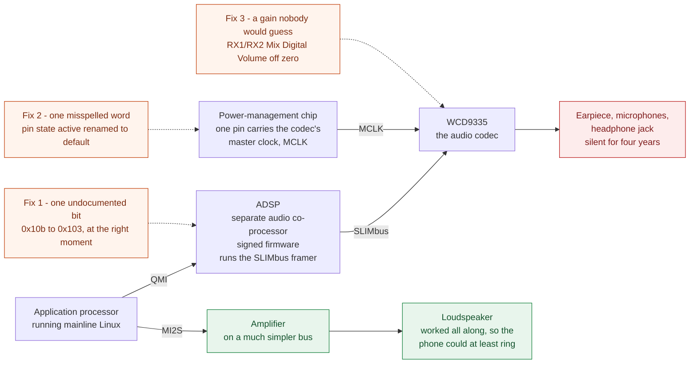
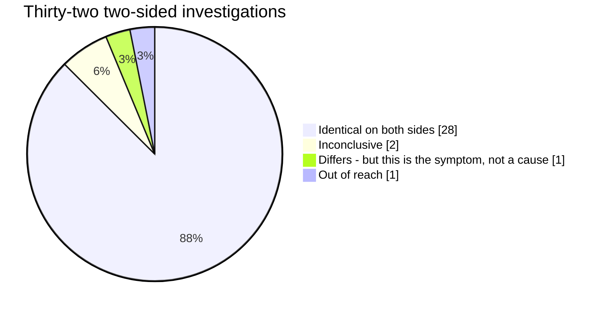

# Fixed After Four Years of Silence — And the Fixer Is Banned

> ⚠️ **AI-generated.** This page — and the code, device tree and tooling it
> describes — was written by Claude (Opus 5) working under the direction of
> Lajosházi, László Gergely, who reviewed every change and made or reviewed
> every measurement it rests on. Kernel commits carry `Co-authored-by: Claude`;
> anything prepared for the LKML carries `Assisted-by:` instead and never a
> `Signed-off-by` from the assistant, since only a human can certify the DCO.

## A Linux port bug nobody could crack, solved by someone who isn't a kernel developer. The two projects closest to the phone won't take the patch.

---

## TL;DR

- **The bug.** On mainline Linux, a Fairphone 3 had no earpiece, no microphone and no headphone jack. Four years, two public attempts, one unanswered mailing-list post. The loudspeaker played, so the phone could ring — but it could not take a call.
- **The cause.** Three things, none of them where anyone was looking: an undocumented co-processor register bit left in the wrong state by the mainline boot path; a pin-configuration state with the wrong *name*, so the codec's clock was never physically switched on; and a digital gain sitting at zero on a mixer branch whose name gives no hint that it is the one that matters.
- **The fix.** Roughly forty lines. Readable over coffee.
- **Finding it.** Two weeks of AI work, most of it running overnight in autonomous mode while I slept.
- **The outcome.** The fix works on the device and is fully published. The downstream fork it lives on and the distribution that would ship it both decline it — not because of what it does, but because of how it was made. Mainline Linux, which has the highest bar, is the only open road.

### Highlights

- **Yes: yet another article about using AI.** The difference is the ending. This one doesn't finish with a demo, it finishes with a merge refusal.
- **A human with no kernel background and an AI solved a genuinely hard problem in a genuinely hard field.** Not a toy, not a web app — a bus-level bring-up bug against signed firmware. In the article's own words: *"I'm not a kernel developer. I didn't know what a DAPM widget was."* It also cuts against the standard objection that an assistant can only recombine what already exists somewhere: here there was nothing to recombine. No prior fix, no forum answer, no patch on any branch anywhere — four years of the bug staying open is the proof of that — and the register that turned out to matter appears in no datasheet at all. The one piece of outside evidence that mattered — a stranger's mailing-list post — contained no solution either: it was an unanswered bug report, and what it supplied was not an answer but the proof that an answer was reachable. That is the honest shape of it. The assistant didn't invent a fix out of nothing; it measured its way to one, at a volume no single person would sustain. And a human had to go looking for the datapoint that said the whole search was pointed the wrong way.
- **The AI solved it — and AI-assisted work is banned by the two projects standing closest to the device.** One bans it outright with code-of-conduct sanctions; the other declines to merge it but points at upstream as the legitimate route.
- **Which leaves a political question with four answers.** **(1) Lie** — claim it as 100% human work and walk straight past the policy, since nothing about the code betrays its origin. **(2) Fork** — stand up a postmarketOS-shaped project that accepts *disclosed* AI-assisted work. **(3) Let it rot** — the code is public, documented to the register level, and free for anyone to pick up; will anyone? **(4) The long road** — submit upstream, where disclosure is allowed and the bar is highest. The first three are exits. Only the fourth is work.
- **And the moral is not the one an AI story usually ends on.** The agent was confidently, elaborately wrong for weeks — and its own thoroughness is what made the wrong conclusion credible, to me and to everyone who read it. What finally broke the case open was a stranger's unanswered email from a year earlier. *You no longer need to be an expert to begin. You need to be stubborn, honest about what you observed versus what you were told, and willing to ask the hardware instead of the story. Expertise can be borrowed. Scepticism can't.*

### Five terms, used throughout

| term | what it means here |
|---|---|
| **mainline** / **downstream** | *Mainline* is the official Linux kernel, publicly reviewed, updated forever. *Downstream* (or "vendor") is the kernel the manufacturer shipped: a years-old fork full of unpublished modifications that nobody maintains any more. Moving a phone from one to the other is what "porting" means here. |
| **ADSP** | A separate audio co-processor inside the chip, running signed — therefore unmodifiable — firmware. |
| **SLIMbus** | A Qualcomm data bus (a pair of wires) over which the audio codec talks to the processor. |
| **framer** | Whatever supplies the beat on that bus: it drives the clock and hands out the time slots. On this phone the framer runs *inside the ADSP*. If it never starts, nothing on the bus can move. |
| **device tree** / **pinmux** | The device tree is a description file telling the kernel what is where on the board — which chip on which pin, which bus at which address. *Pinmux* is the part of it that says what a given physical pin currently does: general-purpose I/O, or a clock, or a bus signal. |
| **"byte-identical"** | Every single byte read from two sides matches. Not "similar", not "essentially the same" — identical to the bit. |

---

# Part I — The story

## 1. A phone that could ring but not talk

I have a 2019 Fairphone 3. Fairphone is the Dutch company that deliberately designs its devices to be
taken apart and repaired. Official Android support, however, is finite — and when it ends the phone
doesn't break, it just stops getting security updates. Which is why a lot of people try to move
devices like this to mainline Linux.

On the Fairphone 3 the port already worked: display, touch, GPU, WiFi, mobile network, camera. Only
audio didn't. More precisely: the loudspeaker played, but the earpiece, the microphones and the
headphone jack were silent. Meaning you couldn't make a phone call with the phone.

To be clear about what kind of bug this was: the hardware is fine. On the vendor kernel that shipped
with the phone, all of it works — same chips, same wires, same signed firmware. This was a porting
bug: something the new kernel doesn't do, or does differently, and nothing in it complains. That
distinction matters, because it means the answer was always in reach. It just didn't look like it.

## 2. Four years, two attempts, one unanswered letter

**2022 — the first port.** Luca Weiss (z3ntu) submits the first Fairphone 3 / MSM8953 support to the
Linux kernel mailing list ([`[PATCH 00/15] Initial MSM8953 & Fairphone 3 support`](https://lore.kernel.org/lkml/?q=%22Initial+MSM8953+%26+Fairphone+3+support%22),
January 2022). The phone lives, it boots, a lot of things work. The audio codec does not. On a
private branch you can find the attempts — the device-tree entries, the clock wiring — but by his own
summary he "never had any luck" with it. The code stays there, commented out.

**2025 — the lone bug report.** On 9 February 2025 Bert Karwatzki writes to the same mailing list
(["wcd9335 efuse sensing fails on fairphone-fp3"](https://lkml.iu.edu/hypermail/linux/kernel/2502.1/00985.html)).
He got one step further: his codec does come up, does get an address on the bus, and then stalls on an
internal self-check:

> "After I get a logical address for the wcd9335 slim device the setup seems to work until it reaches
> `wcd9335_enable_efuse_sensing()`" — followed by a warning that efuse sensing never completed, after
> which every bus write fails.

He ends the mail asking for help identifying the root cause. No one ever replied. Not the codec's
maintainer, not anyone else. One thread, one message, silence. Remember this letter; it is the hinge
of the whole story.

**Summer 2026 — the wall.** When I ran into the same thing, I spent weeks arriving at the same place:
there is no audio because the SLIMbus framer never starts. On the vendor kernel it starts. On mainline
it never does. Same firmware, same hardware.

In July 2026 I opened [issue #255](https://github.com/msm8953-mainline/linux/issues/255) on the
msm8953-mainline project and a thread on the Fairphone forum. My own summary at the time read:

> "everything software-visible is proven identical two-sided — QMI, firmware+devcfg, the full 1 MB
> SMEM… the ADSP accepts the SLIMbus POWER_REQ (QMI OK) but never broadcasts
> `SLIM_USR_MC_MASTER_CAPABILITY` on the bus."

And the conclusion I drew from it: the wall is physical, it lives inside the signed firmware, it
cannot be fixed from outside; what's needed is Qualcomm-internal diagnostic data no outsider can get.

That conclusion was completely wrong, and finding out *why* is the actually interesting part of this
story.

## 3. How it fell

Three changes, in the order they were found. The register-level detail is in
[Part II](#11-the-three-fixes-in-detail); here is what each one was.



*Where the sound goes on this phone, and where the three fixes landed. The loudspeaker never touched
the broken path at all, which is why it worked throughout.*

**Fix 1 — one bit in an undocumented register.** There is a register in the ADSP control block that
appears in no datasheet, sitting literally between two documented ones. Its value differs between the
two boot paths by exactly one bit — set on mainline, clear on vendor. We had recorded that difference
weeks earlier, in an old diff file, and never once tested whether it *caused* anything, because it
looked exactly like the hundred other harmless differences such a comparison throws off. "Obviously a
status flag." Clearing it at the right moment, mid-boot, made the framer answer on the bus and the
codec appear. A four-year wall, one bit — and a bit the main processor can write directly. No vendor
firmware, no signature, no closed access required: the exact opposite of what I had claimed in public.

**Fix 2 — one misspelled word.** The framer ran, the codec appeared, and it still made no sound. The
codec has its own clock arriving from a pin on the power-management chip, and that pin has to be
switched into a particular mode by the device tree. In our description that pin's two states were
named `"active"` and `"sleep"`. But Linux automatically applies exactly one state when a driver
starts: the one named `"default"`. There was no such state, so the pin was never switched at all. In
software everything looked fine — the kernel's clock model reported the clock existed, was enabled,
and had a live use count. In copper there was nothing there. And that is precisely the failure Bert
Karwatzki reported a year earlier and that nobody answered. It was never a codec bug. It was the
consequence of a clock that was never physically present.

**Fix 3 — the volume control nobody would guess.** Framer running, clock present, codec happy. Still
silent — because a digital gain sat at zero and pushed the signal below the smallest representable
value. On this codec the headphone path runs through a mixer's secondary branch, so the volume that
matters is not the one whose name suggests it, and is not the power-amplifier gain either. It is a
third one. You cannot deduce this from the control names; the only way to know is to look at which
elements are actually powered on the live signal path.

Every fix up to the last one was correct, and the measurement still said no. That is the texture of
this kind of work, and it is why the middle of it is so easy to get wrong.

## 4. What the collaboration actually looked like

### What the AI brought

The work was done with Claude Code — an agent in the terminal that reads the kernel source, writes
patches, drives the build, SSHes into the phone and reads the results back. Opus 4.8 for the
investigation and the breakthrough; Opus 5 later, for turning the result into commits fit to submit.

I'm not a kernel developer. I didn't know what a DAPM widget was. What I supplied: the device, the
goal, the physical world (plugging in a headset, placing a real call), and the judgement about what to
believe.

What the AI gave that I could not have produced alone: it held the whole problem at once — kernel
source, bus specification, firmware reverse engineering, live device state — and went from hypothesis
to patch to flash to measurement in a single evening, over and over. Over a few weeks the debug
journal passed two hundred numbered entries.

### Working while I slept

The single biggest multiplier wasn't cleverness. It was that this could run overnight.

The setup that made it possible is mundane: the phone has two system slots, A and B. One holds the
vendor system, the other the experiment. If a kernel refuses to boot, switching the active slot from
the bootloader brings it back — a rollback that can't fail, because it doesn't depend on the broken
side booting at all. Add a stable USB link that comes back by itself after a reboot, and the phone
stops being something you have to babysit.

So the routine became: in the evening I'd hand over what to work on, and the device with it. The agent
could build a kernel, flash it, reboot the phone, capture the result, decide the experiment had
failed, and start the next one — unattended, with the safety rules written down in advance: one change
per run, never touch the thing that would block a boot, leave a breadcrumb in the log so a silent
failure is still legible in the morning, and check the free disk space before every deploy, because a
full log partition on a small root filesystem turns into a reboot loop. Some iterations didn't even
need a reboot: reloading just the co-processor's firmware took about two seconds.

By morning there was progress. Not always the answer — often a whole branch of the hypothesis tree
cleanly eliminated, which is the same thing at a different speed. What that autonomy bought is laid
out in [Part II](#10-everything-that-was-ruled-out): thirty-two independent investigations, each with
its own instrument, its own measurement and its own verdict. Most of them were done while I was
asleep.

What changed isn't that the machine is brilliant. It's that the cost of trying one more thing dropped
to nearly zero, and at that price you can afford to be exhaustive.

### Where the AI was consistently wrong

And now the more important part, because without it this article would be an advertisement.

The AI was repeatedly, confidently wrong — and the wrongness scaled with the effort invested.

It wrote a "definitive root cause" into its permanent notes. The component it blamed was fine, and
works perfectly elsewhere. It declared call audio unsolvable in the near term; that conclusion rested
on live tests that had all run over the wrong audio path, which only surfaced when I mentioned
offhand, "but calls used to work on the speaker." One sentence from the person holding the phone
demolished a week of fluent machine reasoning.

The largest one is public. [Issue #255](https://github.com/msm8953-mainline/linux/issues/255) is a
genuinely impressive document: it proves the kernel-side requests byte-identical to the working vendor
stack, compares firmware, clocks and regulators two-sided, pulls the co-processor's internal logs out
over a debug channel — and then concludes that since everything visible has been ruled out, the
remaining difference can only be on the physical wires, and that what's needed is vendor diagnostic
data no outsider can obtain. In short: *we have ruled out software; we are blocked on access we cannot
get.*

That was false. The bus never synchronised on the physical wires because the clock was never
physically there — because of a misspelled state name in a config file, one layer above everything the
investigation had been staring at. The final symptom, filed as evidence of an intractable vendor wall,
was in fact the textbook signature of a missing clock.

It isn't that the AI hallucinated or got sloppy. The opposite. It reasoned hard, gathered real
evidence, wrote it up better than I could have — and mistook "I have exhausted my hypotheses" for "the
answer is outside." Confidence tracked the amount of work done, not the distance to the truth.

### What finally broke it

Not another measurement. A single piece of external evidence: Bert Karwatzki's 2025 mail, the one
nobody answered, in which he *did* get a bus address for the codec on a near-mainline kernel. One
positive existence proof outweighed an arbitrarily long list of "everything I can compare is the
same".

Which is why there's now a rule written into how I work: before you claim "this can't be fixed
locally", go find an existing, working, near-identical configuration. Another porter's mailing-list
post, a fork, anything. One "it works for me" is stronger than a hundred of your own "everything is
identical here".

## 5. "Working" isn't "done"

Here is the part I hadn't understood: the moment it works is roughly the halfway mark.

The phone made a sound. That proved almost nothing. What remains is everything that makes a change
belong to other people: describing it so a stranger can judge it in two minutes; saying what was
tested on what hardware; narrowing it to one thing; taking the conservative option over the convenient
one; reshaping commits written in the order of discovery into the order of logic; separating the
hardware description from the driver code; running the style checker; and then waiting for someone
with no obligation to you to decide whether your evening is worth their maintenance burden. They may
say no, and they will ask for rework — they usually do. That is the system working correctly; a
project that takes every patch that ran on somebody's desk dies of its own weight.

Meanwhile the change still has to land on the right branch and be mirrored into the integration
branch, or the next person (me, in November, having forgotten everything) finds two histories that
disagree. It has to be packaged so a reinstall reproduces it instead of living as a hand-edited file
that dies with the next flash. And it has to survive the next kernel release.

## 6. Where can this even be submitted

There is a thread in this story that rarely comes up in "look what the AI can do" articles.

The Fairphone 3 port described here is AI-assisted. That is not acceptable in every project — and the
split isn't where you'd expect.

**postmarketOS** — the distribution the phone actually runs — bans AI-assisted contributions, with
code-of-conduct sanctions behind it. So the packaging repository, the thing that puts this kernel on a
phone, deliberately stays a convenience wrapper. No submission planned.

**msm8953-mainline**, the downstream fork this port lives on, sits halfway. The maintainer's own
wording, July 2026: *"we don't merge AI assisted work, it is only allowed at upstream"* — not here,
but with an explicit acknowledgement that further up it is. (The FP3 is an outlier there anyway: it is
the only msm8953/SDM632 device with an external WCD9335 codec on SLIMbus; everything else uses a
simpler bus.)

**Mainline Linux (LKML)** is the one open road. The kernel actually engages with the question: there
is a documented process (`Documentation/process/coding-assistants.rst`) that does not ban the practice
but demands disclosure — the commit carries an `Assisted-by:` line naming the model that actually did
the work, and the AI never signs a `Signed-off-by`, because only a human can make that legal
certification.

So the order of strictness is inverted from the usual expectation: **downstream is stricter than
upstream.** Which in practice means the only place this fix can go is also the highest bar — no "good
enough, works on my desk".

There is a twist that folds the whole thing back to the start of this article. The submission must not
be framed as "this fixes my phone". Headset detection is worth sending upstream because the mainline
WCD9335 driver contains zero jack registration — a gap affecting seven boards, including a reference
platform and several OnePlus and Xiaomi devices. It isn't a Fairphone 3 bug. Same move as the one that
broke the investigation open: go find where else this already exists.

### The exchange

The title of this article isn't a figure of speech. Here it is, in public, on
[issue #197](https://github.com/msm8953-mainline/linux/issues/197), 25 July 2026 — the day after the
phone made a sound.

I reported the fix and asked the obvious question:

> "It has been fixed for Fairphone 3 as well with full slimbus audio (headset, mics […]). Is it ok to
> upstream with AI assisted work? PmOS policy prohibits that."

The maintainer, nine minutes later:

> "FP3 is using different audio architecture and we don't merge AI assisted work, it is only allowed
> at upstream."

So I offered the mechanism that exists precisely for this — a human reviewing the work and taking
responsibility for it:

> "Do you have the capacity to review the work and sign-off the commits to mainline mentioning me as
> co-author in the commits and Claude 'Assisted-by: Claude:claude-opus-4.8'?"

The answer was one word and a link:

> "No, https://mastodon.social/@barni2000/116161573857090786"

The link is the policy, posted on 2 March 2026:

> "Changes and drivers was written by help of AI tools will be not accepted. Do not open any PR. You
> can still send them to upstream following related kernel guidelines."

It's worth being precise about what this is and isn't. It is not censorship, and it isn't personal —
the same post points at the kernel's own documented process as the legitimate route, which is exactly
the one road still open to this work. A maintainer who merges a patch inherits it forever; declining a class
of contribution they can't audit to their own standard is a defensible call, and the provenance and
licensing questions around generated code are genuinely unsettled.

And in fairness, a project's policy is not the same thing as the people in it. The "no" closed the
merge, not the conversation: on the project's
[Matrix channel](https://app.element.io/#/room/#msm8953-mainline:matrix.org), cristian_c went through
the audio patches and gave detailed, genuinely useful feedback — the kind that makes a series better
before it ever reaches a mailing list. Nobody owed me that. It is worth saying plainly, because a
story about being turned away is easy to tell as if everyone had turned away, and that would be false.

But the shape of the outcome is still worth stating plainly. The fix exists. It works on the device.
It is published, documented down to the register level, and its provenance is traceable line by line.
And the two projects standing closest to the phone — the fork the port lives on, and the distribution
that would actually put it in a user's hand — both decline it on the grounds of how it was made rather
than what it does.

There's an irony in the geometry. The only reason to mainline a phone at all is that a device gets
thrown away once nobody maintains its software; mainlining exists to stop that happening. And the
policies that make the last mile hardest sit at the two projects whose entire reason for existing is
that same problem.

## 7. Lie, fork, let it rot — or the long road

Strip the story down and a genuinely political question is left, with exactly four answers. Three of
them are exits. One is work.

**1. Lie.** Nothing in the code says how it was made. Forty lines of C and a renamed device-tree string
carry no watermark; no reviewer can tell, and no tool reliably can either. Submit it as one hundred
per cent human work and the policy simply doesn't engage. This is, by a wide margin, the *easiest*
option — and it is the one that quietly guarantees the policy fails, because the only contributions it
actually filters out are the honestly-labelled ones. A disclosure rule that punishes disclosure
selects for silence. I won't take this route, but I'd be naive to pretend it isn't available, cheap,
and effectively undetectable.

**2. Fork.** Build the thing that's missing: a postmarketOS-shaped project that accepts AI-assisted work
*on the condition that it is disclosed*, reviewed and reproducibly tested — closer to the kernel's own
stance than to a ban. The technical cost is low; the social cost is enormous. Forking a distribution
over a contribution policy splits a small community, duplicates packaging work nobody has spare hours
for, and would probably produce a project with one device and one contributor. It also treats the two
positions as incompatible, and I think they can be reconciled. A fork that only removes the ban would
achieve nothing, because the review problem comes with it.

**3. Let it rot.** Publish everything, walk away, and see whether anyone picks it up. The code is on
GitHub, the measurements are written up, the provenance is line-by-line traceable, and the licence is
GPL — anyone may take it, understand it, and resubmit it as their own reviewed work. This is the
honest option and the passive one. It is also a real bet: a fix that nobody adopts and that nobody
maintains against the next kernel release has a shelf life of about one release cycle. Four years of
silence would resume, this time with the answer sitting in a public repository the whole time.

**4. The long road: upstream.** This is the one I should take, and it is the only answer that isn't an
exit. Mainline Linux permits the practice and demands disclosure, so nothing has to be hidden — but it
also has the highest bar in the chain, and it forces the reframing described in the previous section:
not "this fixes my phone" but "the mainline WCD9335 driver registers no headset jack at all, on seven
boards." The price is months, rework, and commits reshaped from the order of discovery into the order
of logic. There is no shortcut, and there is no guarantee at the end of it. It is also the only route
that ends with the fix maintained by somebody other than me.

The next person will face the same four options, and every project that writes a policy on this will
face the same question. So the rest of this section is about the one part of it that can actually be
changed.

### What would make the long road shorter

Strip away the ideology and a concrete, unglamorous problem remains: reviewing is slower than writing,
and AI widened that gap.

The asymmetry is brutal. An assistant can produce a fluent, well-structured, plausibly-argued
forty-line patch in an evening. Judging whether those forty lines are right takes a human who
understands the hardware, has the datasheet or can infer it, can tell a real measurement from a
confident sentence — and, crucially, can spot the failure mode this whole article is about: work that
is rigorous, well-evidenced, beautifully written, and aimed at the wrong place. My own issue #255 is
exactly that artefact. Any maintainer who read it carefully would have spent hours on a document whose
conclusion was false. That is the cost they are protecting themselves from, and it is real.

Volume makes it worse. One person with an assistant can now generate more patches than they could ever
have written by hand, and the reviewing capacity on the other side did not change at all. A policy of
"no" is a crude instrument, but it is an instrument that works on day one and costs nothing to
enforce.

The interesting question is what would actually shrink that cost, rather than deflect it:

**Reviewing with the same tools.** If an assistant can write the patch, it can also be pointed at it
adversarially — asked to refute it, to find the case where it breaks, to check it against the
subsystem's conventions before a human ever sees it. Much of what I got wrong in this project was
eventually caught by exactly that move, just later than it should have been. Running it before
submission rather than after rejection moves the work to the side that has the capacity for it.

But "ask it to review its own patch" is too vague to be worth much, because the assistant will
happily invent plausible-sounding review criteria. What is missing is something more specific: a
packaged *reviewer's standpoint* — the checks a maintainer actually applies, written down, and each
one anchored to a real case where skipping it produced a bad patch. Not a style checklist, which
already exists and which tooling already enforces. The other half: is this narrowed to one change or
is it four; does the commit message say what was tested on what hardware; is the conservative option
taken over the convenient one; is a device-tree change mixed into driver code; does this claim to fix
a device-specific bug when the same gap affects six other boards; and — the one this whole article is
about — is the evidence exhaustive in a direction that was never checked for being the right
direction. Every one of those has a scar behind it in this project, and a rule that cites its scar is
worth ten that assert themselves.

Something like that is buildable today, as a skill the assistant loads before it prepares a
submission rather than after the maintainer has spent an hour on it. It doesn't make anyone's work
mergeable by itself, and it can't create the hardware knowledge a real reviewer has. What it can do
is move the cheap, mechanical, high-frequency half of a review — the half where most rejections
actually come from — to the side that is producing the volume.

**Evidence a reviewer can check without owning the hardware.** This is the bigger one, and it barely
exists today. Almost every claim in this article is backed by something mechanically verifiable — a
register that reads `0x01` instead of `0x00`, a debug file saying a pin is claimed, a recorded tone at
a measured frequency and level. Those checks are already scripted; they run on the device as a
regression suite. But there is no accepted way to attach that to a patch series so a maintainer can
see "this was tested on this hardware, here is the machine-checkable proof" instead of taking my word
for it. A reviewer who can verify a claim in thirty seconds is in a completely different position from
one who has to reason about it from first principles. Boards in a lab, running real tests against
submitted series, would change the economics of this more than any policy.

Neither of those is exotic. Both are mostly missing. And note where they land: they are what the long
road needs in order to stop being one person's grind — and they are exactly what a serious fork would
have to require on day one. Not "we accept AI-assisted work", but "we accept it if it arrives with the
review already run and the evidence attached." That is the difference between a fork that splits a
community over a policy and one that demonstrates a better policy.

Which is the whole point of this section. The useful question is not "should AI-assisted contributions
be allowed". It's "what does your policy select for?" — because a rule that can only be enforced
against people who tell you the truth selects for people who don't. And making it *easier to submit
AI-assisted work of acceptable quality* is a more tractable problem than deciding whether such work
should be allowed at all.

## 8. The moral

The cheap version: "AI lets you do things you don't understand." Believing that will hurt you.

What actually happened: the agent did what I couldn't — read the source, form the hypothesis, write
the patch, and grind through thirty-two investigations without getting bored. And I did what it
couldn't: hold the ground truth, supply the physical world, and refuse a confident conclusion that
contradicted something I knew. Alone it would have stopped twice at an eloquent wrong answer. Alone
I'd never have started.

What ended every argument was never reasoning, it was a question put to the hardware: a status
register reading `0x01` instead of `0x00`; a debug file confirming whether a pin is claimed; one bit
visibly stuck during a live recording. The model of the system was confident and wrong for weeks. The
hardware was never wrong.

> You no longer need to be an expert to begin. You need to be stubborn, honest about what you have
> observed versus what you were told — and willing to ask the hardware instead of the story.
>
> Expertise can be borrowed. Scepticism can't.

The finished fix: a renamed string, a moved event handler, one register bit at the right moment, and
two lines of routing. Perhaps forty lines, readable over coffee.

Finding them took everything else.

---

# Part II — The technical record

Everything below is the substance the story above rests on: whose code this actually is, the full
elimination table, and the three fixes at register level.

## 9. What was already there, and who built it

This has to be stated plainly, or the whole story becomes a lie: almost none of this is my code. The
port's full [provenance documentation](https://github.com/llg179org/fp3-pmaports/tree/main/docs/kernel)
is public, and its point fits in one sentence:

> "almost nothing here is a new driver: every file is somebody else's work with a Fairphone 3 shaped
> hole filled in."

That page lists it file by file — who wrote each one, when, and what was added here. Follow the link
if you want the detail; the short version is that the local contribution is, in every case, a handful
of lines dropped into a large machine somebody else built.

What of that worked before July 2026: the loudspeaker, and nothing else. And that doesn't even hang
off SLIMbus — it sits on a much simpler bus behind a separate amplifier chip. So the phone could ring
and play music, but with no earpiece, no microphone and no headphone jack it wasn't a phone.

## 10. Everything that was ruled out

**Don't read this table. Scroll it.**

That is not a joke — the point of it is its length. Each row below is a separate investigation with
its own instrument: a byte-level firmware comparison, a live register dump taken from two different
operating systems on the same phone, a firmware patch applied at runtime, a reverse-engineered trace
of every write one chip makes to another. Thirty-two of them. The method throughout is the same:
**the two-sided comparison.** The phone has two system partitions. I put the vendor-based system on
one (where audio works) and mainline on the other (where it is silent), then measured the same thing
on both sides and looked at where they differed.

Setting up any one of these rows is an afternoon's work for a person: decide what to measure, find the
instrument that can measure it, get it onto both sides of a phone, read the result, and decide what it
means. A human working alone does not do thirty-two of them. A human working alone does five or six
and then starts guessing — which is exactly what the previous four years of this bug looked like.
Sustaining this shape of effort, unattended and overnight, is the single most concrete thing the AI
contributed to this project.

Read the "Result" column and notice what it says.



*Every one of these measurements was true. The conclusion drawn from them was false.*

| # | What we examined | How | Result |
|---|---|---|---|
| | **Firmware, and how it gets loaded** | | |
| 1 | The ADSP firmware itself (`adsp.mbn`) | byte comparison + firmware-swap test | ✅ identical — and more: put the mainline firmware onto the *working* system and it starts there |
| 2 | The secure-processor load call sequence | live tracing on both sides | ✅ identical arguments and ordering |
| 3 | Bootloader (lk2nd) | source audit | ✅ identical — it contains zero audio-subsystem operations |
| 4 | The whole shared-memory region (1 MB) | two-sided byte diff | ✅ identical |
| 30 | The choice of loader driver itself | source audit | ⚠️ not ported — but mainline has no alternative, and the evidence says it would match |
| | **Power, clocks, bandwidth** | | |
| 5 | Power and clocks supplied to the ADSP | live regulator/clock test, forced to maximum | ✅ identical — and the framer stays dead anyway |
| 6 | Memory-bandwidth vote (crypto→EBI) | added by patch, tested live | ✅ ruled out as a lever — framer still dead |
| 24 | Power, clocks, power domains, regulators at idle | live sweep | ✅ no anomaly anywhere |
| | **Registers — the widest nets we cast** | | |
| 8 | The entire audio-subsystem clock controller (80 KB of registers) | live memory read on both systems | ✅ byte-identical — PLL settings, dividers, enable bits |
| 9 | The framer's full register aperture (176 KB) | word-by-word diff | ✅ exactly 10 differing words — all of them output status markers, not one configuration register |
| 10 | Every single write the firmware issues to the framer | reverse engineering + live tracing | ✅ identical values |
| 11 | The framer's mode decision (is it the clock source, or is it external?) | live firmware probe | ✅ identical — "itself" on both sides |
| 12 | The bus handshake's internal wait | live firmware probe | ✅ symmetric — both sides time out identically |
| 13 | Forcing that wait to report success | live firmware patch | ✅ still no framing — not a lever |
| | **The bus and the codec** | | |
| 7 | The bus driver's source (mainline vs. vendor) | public source diff | ✅ identical behaviour |
| 14 | Codec power-up and detection | logs + memory dump | ✅ identical |
| 15 | The SLIMbus data-plane/DMA block | live register dump | ✅ configured on both — and downstream of framing anyway |
| 16 | Is there a separate, hidden physical-layer block? | firmware descriptor scan | ✅ no such thing exists |
| 21 | Pin multiplexing on the main processor | device-tree audit | ✅ not relevant — the bus pins are internal to the audio subsystem |
| 25 | Opening an audio port from the working Q6 stack | live playback test | ✅ blocked by the missing codec — the same wall, one layer down |
| | **Ordering, state, inheritance** | | |
| 17 | Does boot ordering matter? | restarting the ADSP on a fully booted system | ✅ no |
| 18 | Does anything get inherited from the working system? | warm reboot from working into silent | ✅ no — the framer came up dead anyway |
| 23 | The firmware's internal state at the moment of failure | full memory dump + analysis | ✅ "mode=ACTIVE, no error flag, all descriptors valid" — the firmware believes it succeeded |
| 29 | A freshly landed upstream fix series | applied, tested | ✅ no change |
| | **The secure world, and hidden channels** | | |
| 19 | The secure world's own runtime log | two-sided ring-buffer read | ✅ identical, no errors — but structurally blind to the framer |
| 20 | Any hidden secure-world call in the audio window | live tracepoint | ✅ zero — there is no hidden call |
| 22 | Memory-protection / access-permission votes | interconnect model audit | ✅ no audio-subsystem master in the model at all |
| 28 | Can the ADSP tell which operating system is running? | firmware audit | ✅ no — there is no such channel |
| | **The co-processor's own logs** | | |
| 26 | The ADSP's debug log under a generic retrigger | debug-channel capture | ⚠️ inconclusive — traffic on the control channel, zero framer messages on the data channel |
| 27 | The ADSP's debug log during real audio on the working side | golden playback capture | ✅ fully readable — confirms what the working side does |
| | **The symptom, and what we couldn't reach** | | |
| 31 | The framer's physical sync indicator | live register read | ❌ differs — but this *is* the symptom: 1 on working, 0 on silent |
| 32 | External, vendor-side electrical capture | — | ❓ not available |

**Twenty-eight rows saying "identical". Two saying "inconclusive". One saying "differs" — and that one
is the symptom itself, not a cause. One saying "I can't reach this."**

From which I concluded that the fault must lie where I cannot see. Every single measurement in that
table was true. The conclusion drawn from them was false.

And this is where the table stops being a triumph and becomes the warning. Its thoroughness is exactly
what made the wrong conclusion credible — to me, and to anyone who read the issue. Thirty-one closed
doors feel like a proof. They are not: they are thirty-one places the answer *wasn't*, which says
nothing whatsoever about where it *was*. The real fault was one layer above everything in this table,
in a config file, and it was never going to appear in any row of it — because every row was a
comparison between two things that were, in that respect, genuinely the same.

An exhaustive search is only as good as the space you searched. The AI expanded the search enormously
and had no way to notice the space itself was wrong. Neither did I, until a stranger's unanswered
mailing-list post from a year earlier told me it must be.

## 11. The three fixes, in detail

### Fix 1 — an undocumented bit, at the right moment

The turn didn't come from another measurement. It came from three questions:

1. Was there really no configuration difference anywhere at all?
2. Could a chip-internal register's value depend on which path loaded the firmware, even when every
   input is identical?
3. Then set the working system's value on the silent one and see what happens.

There is an undocumented register in the ADSP control block at address `0x0c20002c` — it appears in no
datasheet and sits literally between two documented registers. Its value differs between the two boot
paths by exactly one bit:

- vendor load (PIL): `0x103` — bit 3 clear
- mainline load (PAS): `0x10b` — bit 3 set

We had recorded this difference weeks earlier, in an old diff file, and never once tested whether it
caused anything, because it looked exactly like the hundred other harmless differences such a
comparison throws off. "Obviously a status flag."

The live test, writing `0x10b → 0x103` mid-boot:

```
qcom,slim-ngd-ctrl: slim-framer quirk: 0x10b->0x103
qcom,slim-ngd-ctrl: SLIM SAT: Rcvd master capability     ← the framer answers
wcd9335-slim: WCD9335 CODEC version is v2.0              ← the codec appears on the bus
```

A four-year wall, one bit. And a bit the main processor can write directly — no vendor firmware, no
signature, no closed access required. The exact opposite of what I had claimed in the issue.

One important detail: **timing matters too.** Clear the bit right after firmware start and it does
nothing, because the ADSP sets it again during its own initialisation. The clear has to land
immediately before the bus handshake. Which means the fix placed in the "obvious" spot doesn't work,
and anyone who tried it there would have concluded the idea was wrong.

### Fix 2 — one misspelled word

The framer started, the codec appeared — and it still made no sound. Half a second of audio, then
silence, with data-overflow errors.

The codec's own clock (MCLK) arrives from a pin on the power-management chip. For it to get there,
that pin has to be switched into a particular mode, and that is described by the device tree. In our
description that pin's two states were named `"active"` and `"sleep"`. But Linux automatically applies
exactly one state at probe time: the one named `"default"`. There was no such state. So the pin was
never switched at all.

It was directly visible in debugfs: `pin 0 (gpio1): (MUX UNCLAIMED)` — "nobody claimed this pin's
function".

In software everything looked fine. The kernel's clock model reported that the clock existed, was
enabled, and had a live use count. In copper there was nothing there.

After renaming one word, the codec's own status register flipped from `0x00` to `0x01` — the chip's
hardware self-check confirming that the clock had physically arrived. And that is precisely the
failure Bert Karwatzki reported on the mailing list a year earlier and that nobody answered. It was
never a codec bug. It was the consequence of a missing clock.

*(Extra twist: the rename alone wasn't enough either — extra electrical settings in the state made the
state-apply fail outright, which in turn aborted the whole clock-gate driver's probe. It had to be
stripped to the bare mux selector.)*

### Fix 3 — the gain on the branch nobody names

Framer running, clock present, codec happy. Silent.

Because a digital gain control sat at zero and pushed the signal below the smallest representable
value. The twist: on this codec the headphone path runs through the interpolator's *secondary* branch,
so the volume that matters isn't the one whose name suggests it (`RX Digital Volume`), and isn't the
power-amp gain either — it's a third one, `RX1/RX2 Mix Digital Volume`. You cannot deduce this from
the control names; the only way to know is to look at which elements are actually powered on the live
signal path (the kernel's debugfs will show you).

## 12. Where all of this lives

The work is public, under [github.com/llg179org](https://github.com/llg179org) — three repositories:

| repository | what's in it |
|---|---|
| [`linux`](https://github.com/llg179org/linux) | the kernel work itself: mainline Linux audio for the Fairphone 3 — playback, microphone, call audio, headset detection — plus camera, charger and sensor bring-up. An upstream series is being prepared; nothing has been sent yet. |
| [`fp3-pmaports`](https://github.com/llg179org/fp3-pmaports) | the postmarketOS package that makes the kernel work testable — deliberately just a convenience wrapper, with no submission planned, because of postmarketOS's AI policy. The full provenance and bring-up documentation lives here too, including the complete version of the table in section 10. |
| [`Claude-skills-Fairphone3`](https://github.com/llg179org/Claude-skills-Fairphone3) | the method, packaged so it is reusable rather than trapped in this article: how to acquire ground truth on a phone you can't see into (dual-slot A/B, golden traces, register and firmware inspection), how to run a single kernel experiment safely enough to leave it unattended overnight, and how to reshape discovery-ordered commits into a submission a maintainer can review. Three skills, no status, no roadmaps — only method and traps. |

---

*Fairphone 3 (MSM8953/SDM632), postmarketOS, mainline Linux. The code and tooling described here was
written with Claude Code under the direction of Lajosházi, László Gergely, who reviewed every change
and made or reviewed every measurement it rests on. Opus 4.8 did the investigation and the
breakthrough; Opus 5 prepared the commits and the upstream series afterwards.*

*The wrong conclusion, as a permanent public record:
[msm8953-mainline/linux#255](https://github.com/msm8953-mainline/linux/issues/255) ·
Bert Karwatzki's unanswered mail:
[LKML, 2025-02-09](https://lkml.iu.edu/hypermail/linux/kernel/2502.1/00985.html) ·
Luca Weiss' first FP3 port:
[LKML, 2022-01](https://lore.kernel.org/lkml/?q=%22Initial+MSM8953+%26+Fairphone+3+support%22) ·
The merge refusal:
[msm8953-mainline/linux#197](https://github.com/msm8953-mainline/linux/issues/197) ·
Forum thread:
[forum.fairphone.com](https://forum.fairphone.com/t/fp3-on-mainline-linux-one-bsp-side-pointer-needed-to-unblock-audio-slimbus-framer-before-support-ends-in-august/132585)*
